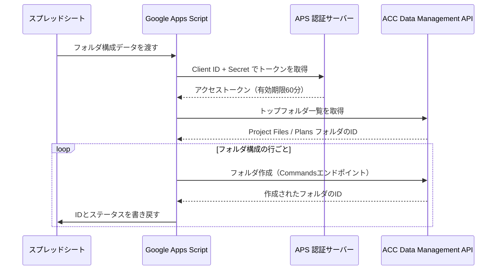
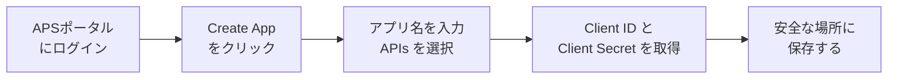
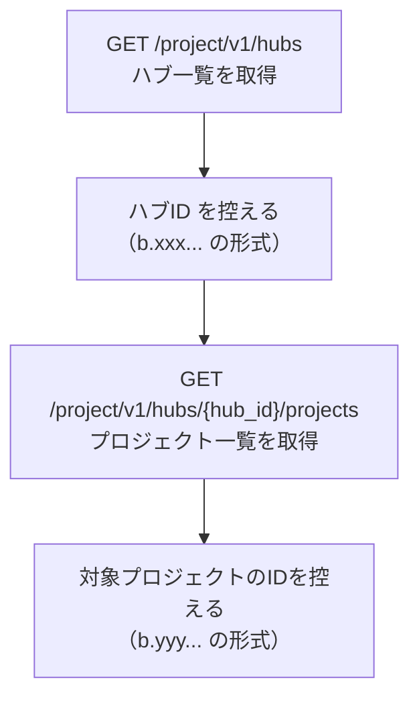
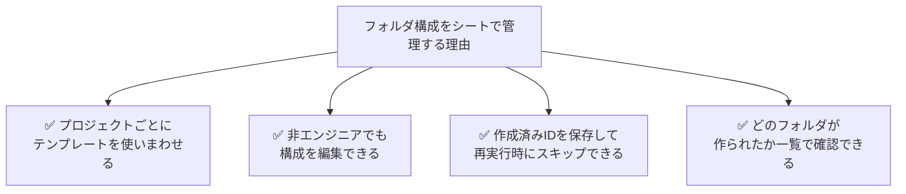
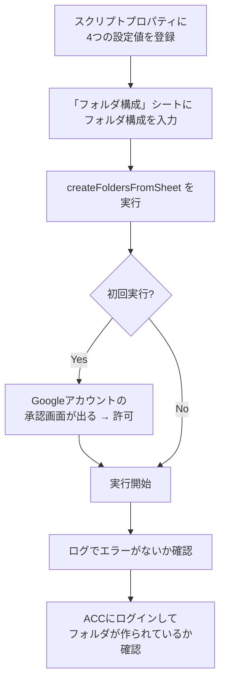
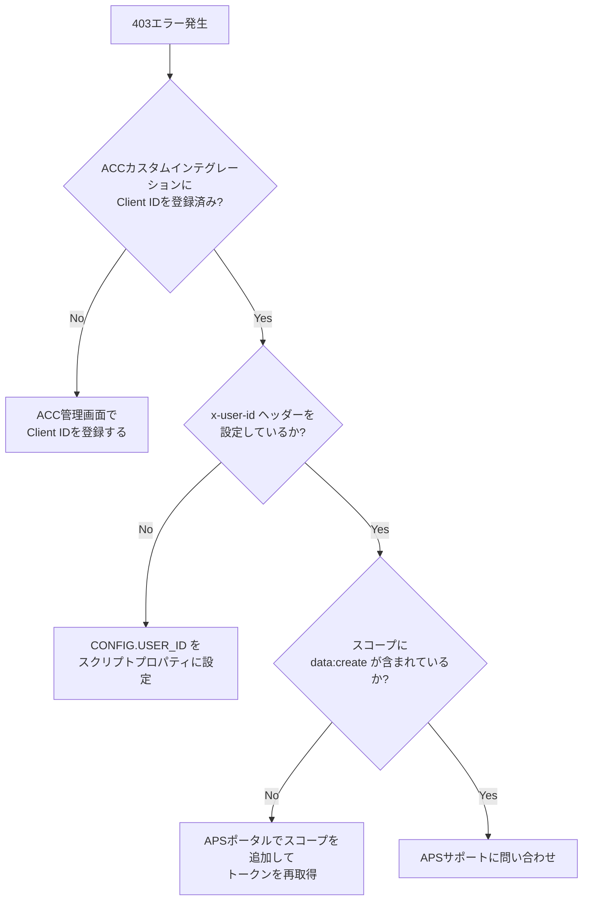

## はじめに

新しいACCプロジェクトが始まるたびに、同じフォルダ構成を手動で作る作業に時間を取られていませんか？

`01_WIP` → `建築` → `図面` → `モデル`...何十ものフォルダをひとつずつ作るのは、ミスも起きやすく地味に消耗します。

この記事では、**Google Apps Script（GAS）** と **Autodesk Platform Services（APS）のData Management API** を使って、Googleスプレッドシートに書いたフォルダ構成を ACC（Autodesk Construction Cloud）に自動で一括作成する仕組みを作ります。

**この記事でできること**:
- スプレッドシートでフォルダ構成を管理
- ボタン1クリックでACCに全フォルダを自動作成
- 再実行しても壊れない冪等（べきとう）な設計

**対象読者**: ACCを業務で使っているBIM担当者・建設エンジニア（プログラミング初〜中級）
**前提条件**: Googleアカウント・ACCアカウント・APSデベロッパーアカウントがあること
**所要時間**: 約45〜60分

---

## 完成イメージ

スプレッドシートにこんな構成を書いたら...

| レベル1 | レベル2 | レベル3 | フォルダID | ステータス |
|--------|--------|--------|----------|----------|
| 01_WIP | | | | 未作成 |
| 01_WIP | 建築 | | | 未作成 |
| 01_WIP | 建築 | 図面 | | 未作成 |
| 01_WIP | 建築 | モデル | | 未作成 |
| 02_Shared | | | | 未作成 |
| 02_Shared | 建築 | | | 未作成 |

GASを実行すると ACCに自動でフォルダが作られ、シートが更新されます。

| レベル1 | レベル2 | レベル3 | フォルダID | ステータス |
|--------|--------|--------|----------|----------|
| 01_WIP | | | urn:adsk.wipprod:fs.folder:co.xxxxx | ✅ 作成済 |
| 01_WIP | 建築 | | urn:adsk.wipprod:fs.folder:co.yyyyy | ✅ 作成済 |
| 01_WIP | 建築 | 図面 | urn:adsk.wipprod:fs.folder:co.zzzzz | ✅ 作成済 |
...

---

## 全体の仕組みを理解する

まず処理の全体像を把握しましょう。



**3つの主要コンポーネント**:

```
┌─────────────────────────────────────────────────┐
│  Googleスプレッドシート                            │
│  └── フォルダ構成を「設計図」として管理              │
└──────────────────┬──────────────────────────────┘
                   │ データ読み書き
┌──────────────────▼──────────────────────────────┐
│  Google Apps Script（GAS）                        │
│  └── 処理の司令塔。API呼び出し・結果書き戻しを担当    │
└──────────────────┬──────────────────────────────┘
                   │ REST API
┌──────────────────▼──────────────────────────────┐
│  Autodesk Platform Services（APS）                │
│  ├── 認証サーバー（OAuth2 トークン発行）             │
│  └── Data Management API（フォルダ作成）            │
└─────────────────────────────────────────────────┘
```

---

## 事前準備

### 1. APSアプリを登録する

[APSデベロッパーポータル](https://aps.autodesk.com/myapps) にアクセスし、アプリを作成します。



**スコープの設定（重要）**:
アプリ作成時に以下のスコープを必ず有効にしてください。

| スコープ | 必要な理由 |
|---------|-----------|
| `data:read` | フォルダ一覧・IDの読み取り |
| `data:write` | フォルダ情報の更新 |
| `data:create` | 新規フォルダの作成 ← **これがないと作成できない** |
| `account:read` | ハブ・プロジェクト情報の取得 |

### 2. ACCにカスタムインテグレーションを登録する

⚠️ **ここを忘れると403エラーになります。** APSでアプリを作っただけでは、ACCにアクセスする権限がありません。

**ACCアカウント管理者が行う手順**:

```
ACC管理画面
└── アカウント管理
    └── カスタムインテグレーション
        └── 「追加」→ Client ID を入力して保存
```

### 3. 必要な情報を事前に取得する

以下の4つの情報をスクリプトプロパティ（後述）に保存します。

| 変数名 | 内容 | 取得方法 |
|-------|------|---------|
| `CLIENT_ID` | APSアプリのID | APSポータルで確認 |
| `CLIENT_SECRET` | APSアプリのシークレット | APSポータルで確認 |
| `PROJECT_ID` | ACCプロジェクトのID | API経由で取得（後述） |
| `USER_ID` | 操作するユーザーのAutodesk ID | API経由で取得（後述） |

**プロジェクトIDの取得方法**:

GASのログで確認する簡単な方法を後述しますが、流れはこうです。



---

## スプレッドシートを設計する

### シートの構成

「フォルダ構成」というシート名で以下の列を用意します。

```
A列: レベル1フォルダ名（必須）
B列: レベル2フォルダ名（空白OK）
C列: レベル3フォルダ名（空白OK）
D列: 作成済フォルダID（GASが自動入力）
E列: ステータス（GASが自動入力）
```

### 記入例（ISO 19650準拠の構成）

実際のプロジェクトでよく使われる構成を入力してみましょう。

| A（レベル1） | B（レベル2） | C（レベル3） | D（フォルダID） | E（ステータス） |
|------------|------------|------------|--------------|--------------|
| 01_WIP | | | | |
| 01_WIP | 建築 | | | |
| 01_WIP | 建築 | 図面 | | |
| 01_WIP | 建築 | モデル | | |
| 01_WIP | 構造 | | | |
| 01_WIP | 構造 | 図面 | | |
| 01_WIP | 設備 | | | |
| 02_Shared | | | | |
| 02_Shared | 建築 | | | |
| 02_Shared | 構造 | | | |
| 03_Published | | | | |
| 04_Archived | | | | |

**ポイント**:
- フォルダを作りたい階層を行で表現します
- 上位フォルダを先に書く順番にしてください（GASが上から順に処理するため）
- D列・E列はGASが自動で埋めます。最初は空欄でOKです

### なぜこの設計にするのか



---

## GASコードを実装する

GASエディタを開き（スプレッドシートの「拡張機能」→「Apps Script」）、以下のコードを貼り付けます。

### ステップ1: 設定ファイル（config.gs）

まず設定を別ファイルにまとめます。スクリプトプロパティに機密情報を保管することで、コードに直接書かずに済みます。

```javascript
// config.gs

/**
 * スクリプトプロパティから設定を取得する
 * 設定方法: Apps Script エディタ → プロジェクトの設定 → スクリプト プロパティ
 * キー名: CLIENT_ID, CLIENT_SECRET, PROJECT_ID, USER_ID
 */
const CONFIG = {
  get CLIENT_ID()     { return PropertiesService.getScriptProperties().getProperty('CLIENT_ID'); },
  get CLIENT_SECRET() { return PropertiesService.getScriptProperties().getProperty('CLIENT_SECRET'); },
  get PROJECT_ID()    { return PropertiesService.getScriptProperties().getProperty('PROJECT_ID'); },
  get USER_ID()       { return PropertiesService.getScriptProperties().getProperty('USER_ID'); },
  SHEET_NAME: 'フォルダ構成',
  APS_BASE_URL: 'https://developer.api.autodesk.com',
};
```

**スクリプトプロパティへの登録手順**:

```
Apps Script エディタ
└── ⚙️ プロジェクトの設定
    └── スクリプト プロパティ
        ├── CLIENT_ID    = （APSのClient ID）
        ├── CLIENT_SECRET = （APSのClient Secret）
        ├── PROJECT_ID   = b.xxxxxxxx-xxxx-xxxx-xxxx-xxxxxxxxxxxx
        └── USER_ID      = （AutodeskユーザーのID）
```

### ステップ2: 認証（auth.gs）

```javascript
// auth.gs

/**
 * 2-legged OAuth2でアクセストークンを取得する
 * トークンの有効期限は60分。毎回新しく取得する。
 */
function getAccessToken() {
  const credentials = Utilities.base64Encode(
    CONFIG.CLIENT_ID + ':' + CONFIG.CLIENT_SECRET
  );

  const response = UrlFetchApp.fetch(
    CONFIG.APS_BASE_URL + '/authentication/v2/token',
    {
      method: 'post',
      headers: {
        'Authorization': 'Basic ' + credentials,
        'Content-Type': 'application/x-www-form-urlencoded'
      },
      // スコープを指定（フォルダ作成に必要な4つ）
      payload: 'grant_type=client_credentials' +
               '&scope=data%3Aread%20data%3Awrite%20data%3Acreate%20account%3Aread',
      muteHttpExceptions: true
    }
  );

  if (response.getResponseCode() !== 200) {
    throw new Error('トークン取得失敗: ' + response.getContentText());
  }

  return JSON.parse(response.getContentText()).access_token;
}
```

### ステップ3: フォルダ操作（folders.gs）

```javascript
// folders.gs

/**
 * トップフォルダ（Project Files）のIDを取得する
 * ACCはルートの「Plans」「Project Files」直下から階層を作れる
 */
function getTopFolderContents(token, projectId) {
  const url = `${CONFIG.APS_BASE_URL}/project/v1/hubs/${getHubId(token)}/projects/${projectId}/topFolders`;
  const response = UrlFetchApp.fetch(url, {
    headers: {
      'Authorization': 'Bearer ' + token
    },
    muteHttpExceptions: true
  });
  const data = JSON.parse(response.getContentText());
  // "Project Files" フォルダのIDを返す
  return data.data.find(f => f.attributes.name === 'Project Files').id;
}

/**
 * ハブIDを取得する（プロジェクトIDの取得に必要）
 */
function getHubId(token) {
  const response = UrlFetchApp.fetch(
    CONFIG.APS_BASE_URL + '/project/v1/hubs',
    {
      headers: { 'Authorization': 'Bearer ' + token },
      muteHttpExceptions: true
    }
  );
  const data = JSON.parse(response.getContentText());
  return data.data[0].id; // 最初のハブを使用（複数ある場合は調整）
}

/**
 * ACCにフォルダを1つ作成する
 * ※ フォルダ作成は POST /commands エンドポイントを使う（直感に反するが正しい方法）
 *
 * @param {string} token       - アクセストークン
 * @param {string} projectId   - ACCプロジェクトID（b.xxx 形式）
 * @param {string} parentId    - 親フォルダのID
 * @param {string} folderName  - 作成するフォルダ名
 * @returns {string} 作成されたフォルダのID
 */
function createFolder(token, projectId, parentId, folderName) {
  const url = `${CONFIG.APS_BASE_URL}/data/v1/projects/${projectId}/commands`;

  // JSON:API形式のリクエストボディ（ACCの仕様）
  const body = {
    jsonapi: { version: '1.0' },
    data: {
      type: 'commands',
      attributes: {
        extension: {
          type: 'commands:autodesk.core:CreateFolder',
          version: '1.0.0',
          data: { requiredAction: 'create' }
        }
      },
      relationships: {
        resources: { data: [{ type: 'folders', id: '1' }] }
      }
    },
    included: [{
      type: 'folders',
      id: '1', // ローカルの仮ID（リレーション参照用）
      attributes: {
        name: folderName,
        extension: {
          type: 'folders:autodesk.bim360:Folder',
          version: '1.0'
        }
      },
      relationships: {
        parent: { data: { type: 'folders', id: parentId } }
      }
    }]
  };

  const response = UrlFetchApp.fetch(url, {
    method: 'post',
    headers: {
      'Authorization': 'Bearer ' + token,
      'Content-Type': 'application/vnd.api+json',
      'x-user-id': CONFIG.USER_ID  // ← 2-legged認証では必須
    },
    payload: JSON.stringify(body),
    muteHttpExceptions: true
  });

  const code = response.getResponseCode();

  // レート制限（429）の場合はリトライ
  if (code === 429) {
    const retryAfter = (response.getHeaders()['Retry-After'] || 60) * 1000;
    Logger.log(`レート制限。${retryAfter / 1000}秒後にリトライ...`);
    Utilities.sleep(retryAfter);
    return createFolder(token, projectId, parentId, folderName);
  }

  // 同名フォルダが既に存在する場合は既存IDを取得して返す
  if (code === 409) {
    Logger.log(`"${folderName}" は既に存在します。スキップします。`);
    return getExistingFolderId(token, projectId, parentId, folderName);
  }

  if (code !== 200) {
    throw new Error(`フォルダ作成失敗 "${folderName}" [${code}]: ${response.getContentText()}`);
  }

  const result = JSON.parse(response.getContentText());
  return result.included[0].id;
}

/**
 * 既存フォルダのIDをフォルダ内容から検索して取得する
 * （409エラー時の冪等対応用）
 */
function getExistingFolderId(token, projectId, parentId, folderName) {
  const url = `${CONFIG.APS_BASE_URL}/data/v1/projects/${projectId}/folders/${encodeURIComponent(parentId)}/contents`;
  const response = UrlFetchApp.fetch(url, {
    headers: { 'Authorization': 'Bearer ' + token },
    muteHttpExceptions: true
  });
  const data = JSON.parse(response.getContentText());
  const folder = data.data.find(
    item => item.type === 'folders' && item.attributes.name === folderName
  );
  return folder ? folder.id : null;
}
```

### ステップ4: メイン処理（main.gs）

```javascript
// main.gs

/**
 * メイン処理: スプレッドシートからフォルダ構成を読み込みACCに作成する
 * スプレッドシートのボタンまたはメニューから実行する
 */
function createFoldersFromSheet() {
  const ss = SpreadsheetApp.getActiveSpreadsheet();
  const sheet = ss.getSheetByName(CONFIG.SHEET_NAME);

  if (!sheet) {
    SpreadsheetApp.getUi().alert(`シート「${CONFIG.SHEET_NAME}」が見つかりません`);
    return;
  }

  // ヘッダー行（1行目）を除いたデータを全件取得
  const data = sheet.getDataRange().getValues().slice(1);

  Logger.log('トークンを取得中...');
  const token = getAccessToken();

  Logger.log('トップフォルダのIDを取得中...');
  const topFolderId = getTopFolderContents(token, CONFIG.PROJECT_ID);

  // フォルダIDのキャッシュ（同セッション内での重複API呼び出しを防ぐ）
  // キー: "レベル1名/レベル2名" → 値: フォルダID
  const folderIdCache = {};

  let createdCount = 0;
  let skippedCount = 0;

  for (let i = 0; i < data.length; i++) {
    const row = data[i];
    const lv1 = row[0] ? String(row[0]).trim() : '';
    const lv2 = row[1] ? String(row[1]).trim() : '';
    const lv3 = row[2] ? String(row[2]).trim() : '';
    const existingId = row[3] ? String(row[3]).trim() : '';
    const rowIndex = i + 2; // シートの行番号（ヘッダー分+1）

    // 作成済みの行はスキップ
    if (existingId) {
      Logger.log(`行${rowIndex}: スキップ（作成済み）`);
      skippedCount++;
      continue;
    }

    // レベル1フォルダの処理
    if (lv1 && !lv2 && !lv3) {
      Logger.log(`行${rowIndex}: レベル1フォルダ "${lv1}" を作成中...`);
      const folderId = createFolder(token, CONFIG.PROJECT_ID, topFolderId, lv1);
      folderIdCache[lv1] = folderId;
      // シートにIDとステータスを書き込む
      sheet.getRange(rowIndex, 4).setValue(folderId);
      sheet.getRange(rowIndex, 5).setValue('✅ 作成済');
      createdCount++;
    }

    // レベル2フォルダの処理
    else if (lv1 && lv2 && !lv3) {
      const parentId = folderIdCache[lv1];
      if (!parentId) {
        sheet.getRange(rowIndex, 5).setValue('⚠️ 親フォルダIDなし');
        continue;
      }
      Logger.log(`行${rowIndex}: レベル2フォルダ "${lv1}/${lv2}" を作成中...`);
      const folderId = createFolder(token, CONFIG.PROJECT_ID, parentId, lv2);
      folderIdCache[`${lv1}/${lv2}`] = folderId;
      sheet.getRange(rowIndex, 4).setValue(folderId);
      sheet.getRange(rowIndex, 5).setValue('✅ 作成済');
      createdCount++;
    }

    // レベル3フォルダの処理
    else if (lv1 && lv2 && lv3) {
      const parentId = folderIdCache[`${lv1}/${lv2}`];
      if (!parentId) {
        sheet.getRange(rowIndex, 5).setValue('⚠️ 親フォルダIDなし');
        continue;
      }
      Logger.log(`行${rowIndex}: レベル3フォルダ "${lv1}/${lv2}/${lv3}" を作成中...`);
      const folderId = createFolder(token, CONFIG.PROJECT_ID, parentId, lv3);
      sheet.getRange(rowIndex, 4).setValue(folderId);
      sheet.getRange(rowIndex, 5).setValue('✅ 作成済');
      createdCount++;
    }

    // API呼び出し間隔を空ける（レート制限対策）
    Utilities.sleep(200);
  }

  const message = `完了！\n作成: ${createdCount}フォルダ\nスキップ: ${skippedCount}フォルダ`;
  Logger.log(message);
  SpreadsheetApp.getUi().alert(message);
}
```

---

## 実行して確認する

### ボタンをシートに追加する（任意）

スプレッドシートに実行ボタンを追加すると便利です。

```
スプレッドシート
└── 挿入 → 図形描画
    └── 図形（四角形）を描いて「フォルダ作成」とテキストを入力
        └── 右クリック → スクリプトを割り当て → createFoldersFromSheet
```

### 初回実行の手順



### 実行ログの見方

GASのログコンソール（`表示` → `ログ`）で進捗を確認できます。

```
[INFO] トークンを取得中...
[INFO] トップフォルダのIDを取得中...
[INFO] 行2: レベル1フォルダ "01_WIP" を作成中...
[INFO] 行3: レベル2フォルダ "01_WIP/建築" を作成中...
[INFO] 行4: レベル3フォルダ "01_WIP/建築/図面" を作成中...
...
[INFO] 完了！ 作成: 12フォルダ / スキップ: 0フォルダ
```

---

## トラブルシューティング

よくあるエラーと対処法をまとめます。

| エラー / 症状 | 原因 | 対処法 |
|-------------|------|-------|
| `403 Forbidden` | カスタムインテグレーション未登録 | ACCアカウント管理でClient IDを登録 |
| `403 Forbidden` | `x-user-id` ヘッダーがない | CONFIG.USER_ID が正しく設定されているか確認 |
| `401 Unauthorized` | スコープ不足 | APSアプリの `data:create` スコープを有効化 |
| `409 Conflict` | 同名フォルダが既に存在 | 正常（既存フォルダのIDを取得して続行） |
| `429 Too Many Requests` | レート制限超過 | コードが自動リトライ。フォルダ数が多い場合は `Utilities.sleep()` の間隔を延ばす |
| シートのIDが空のまま | 変数のスコープ問題 | `folderIdCache` が正しく渡されているか確認 |
| 「権限エラー」ダイアログ | GASのスクリプト権限 | 初回実行時の承認画面で「許可」をクリック |

### 403エラーのデバッグフロー



---

## まとめ

この記事で作ったものを振り返ります。

```
✅ スプレッドシートでACCのフォルダ構成を管理する仕組み
✅ GAS + APS Data Management APIでフォルダを自動作成
✅ 再実行しても安全な冪等設計（作成済みはスキップ）
✅ レート制限やエラーへの対応
```

**学んだ重要ポイント**:

1. **Commandsエンドポイントを使う** — `POST /projects/:id/folders` ではなく `POST /projects/:id/commands` が正しい
2. **x-user-id ヘッダーが必須** — 2-legged認証でフォルダ操作するには必ず設定する
3. **ACCカスタムインテグレーションの登録を忘れない** — 403エラーの最大の原因
4. **409は成功として扱う** — 再実行時の安定性を上げる設計の肝

新しいプロジェクトが始まるたびに、このスクリプトを使えばフォルダ作成の手間から解放されます。テンプレートをスプレッドシートとして管理しておけば、チームでも共有・再利用しやすくなります。

## 参考リンク

- [APS Data Management API ドキュメント](https://aps.autodesk.com/developer/overview/data-management-api)
- [POST /projects/:project_id/commands リファレンス](https://aps.autodesk.com/en/docs/data/v2/reference/http/projects-project_id-commands-POST)
- [APS 認証 v2 リファレンス](https://aps.autodesk.com/en/docs/oauth/v2/reference/http/gettoken-POST)
- [Google Apps Script UrlFetchApp](https://developers.google.com/apps-script/reference/url-fetch/url-fetch-app)
- [GAS ベストプラクティス](https://developers.google.com/apps-script/guides/support/best-practices)
- [ACC-001: APS OAuth認証入門（シリーズ前回記事）](../ACC-001/index.md)
