## はじめに

ACC（Autodesk Construction Cloud）のデータをAPIで操作できたら、日常業務がどれだけ楽になるでしょうか？

フォルダの一括作成、プロジェクト情報の自動取得、ファイルの定期バックアップ...。API連携の可能性は無限ですが、最初の壁は**「認証」**です。

この記事では、**Autodesk Platform Services（APS）** の **OAuth 2.0認証** を使って、ACCのプロジェクト一覧を取得するところまでを、ゼロからステップバイステップで解説します。

**この記事でできること**:
- APSアプリを登録して API を使える状態にする
- OAuth 2.0 の 2-legged認証でアクセストークンを取得する
- GAS（Google Apps Script）でハブ一覧・プロジェクト一覧を取得する
- JSON:API形式のレスポンスを読み解く

**対象読者**: ACCを業務で使っているBIM担当者・建設エンジニア（プログラミング初〜中級）
**前提条件**: Googleアカウント・ACCアカウントがあること
**所要時間**: 約30〜45分

---

## APSとは何か

### Forge から APS へのリブランド

「APS」という名前を初めて聞いた方もいるかもしれません。実は、以前 **Autodesk Forge** と呼ばれていたプラットフォームが、2023年に **Autodesk Platform Services（APS）** にリブランド（名称変更）されました。

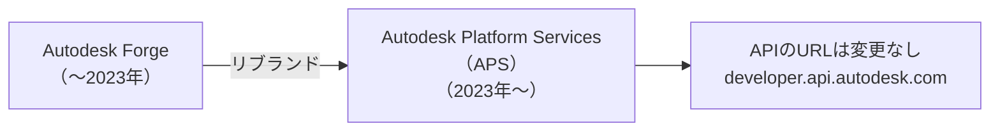

| 項目 | 変更前（Forge） | 変更後（APS） |
|------|---------------|-------------|
| サービス名 | Autodesk Forge | Autodesk Platform Services |
| ポータルURL | forge.autodesk.com | **aps.autodesk.com** |
| APIエンドポイント | developer.api.autodesk.com | **変更なし**（そのまま） |
| ドキュメント | 旧Forgeドキュメント | **aps.autodesk.com/developer/documentation** |
| 既存のClient ID | そのまま使える | **変更なし** |

ポイントは、**APIのエンドポイントURL自体は変わっていない** ということです。ネット上の古い記事に「Forge」と書いてあっても、コードはそのまま動きます。ただし、公式ドキュメントやポータルは APS に移行しているため、新しいURLでアクセスしましょう。

### APSでできること

APSは、Autodeskの様々なクラウドサービスと連携するためのAPI群です。

```
APS（Autodesk Platform Services）
├── Authentication API    ← 今回使う（認証・トークン取得）
├── Data Management API   ← 今回使う（ハブ・プロジェクト取得）
├── BIM 360 API           ← ACC/BIM 360の管理操作
├── Model Derivative API  ← 3Dモデルの変換・表示
├── ACC API               ← Issues, RFI, Cost など
├── Webhooks API          ← イベント通知
└── その他多数...
```

今回は **Authentication API** と **Data Management API** の2つだけを使います。

---

## APSアプリの登録手順

APIを使うには、まず「APSアプリ」を作成して、**Client ID** と **Client Secret** を取得する必要があります。これは、APIにアクセスするための「鍵」のようなものです。

### 登録の流れ

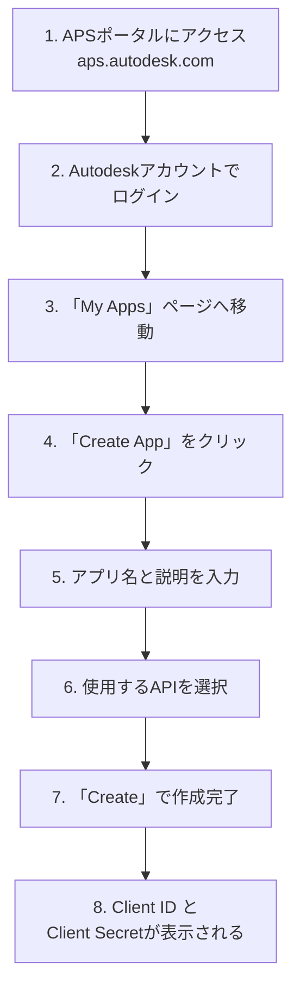

### 具体的な手順

**ステップ1**: [APSデベロッパーポータル](https://aps.autodesk.com/myapps) にアクセスしてログインします。

**ステップ2**: 「Create App」ボタンをクリックします。

**ステップ3**: 以下を入力します。

| 入力項目 | 入力例 | 説明 |
|---------|-------|------|
| App name | ACC連携ツール | わかりやすい名前（日本語OK） |
| App description | GASからACCを操作するツール | 用途の説明 |
| APIs | Data Management API, BIM 360 API | 使用するAPIにチェック |
| Callback URL | （空欄でOK） | 2-legged認証では不要 |

**ステップ4**: 「Create」をクリックすると、Client ID と Client Secret が表示されます。

```
┌─────────────────────────────────────────────┐
│  App Created Successfully!                   │
│                                              │
│  Client ID:     AbCdEfGhIjKlMnOpQrStUvWx    │
│  Client Secret: xYz1234567890AbCdEfGh        │
│                                              │
│  ⚠️ Client Secret は今しか表示されません。      │
│     安全な場所に必ず保存してください。            │
└─────────────────────────────────────────────┘
```

:::message alert
**Client Secret は絶対に外部に公開しないでください。** GitHubにコミットしたり、チャットに貼り付けたりするのは厳禁です。後述の「スクリプトプロパティ」に安全に保管します。
:::

### ACCカスタムインテグレーションの登録

APSアプリを作っただけでは、ACCのデータにはアクセスできません。ACCの管理画面で、作成したアプリを「信頼できるアプリ」として登録する必要があります。

```
ACC管理画面（admin.b360.autodesk.com）
└── アカウント管理
    └── 設定
        └── カスタムインテグレーション
            └── 「カスタムインテグレーションを追加」
                ├── Client ID を入力
                └── アプリ名を確認して「追加」
```

:::message
**この手順はACCアカウントの管理者権限が必要です。** 自分が管理者でない場合は、管理者に依頼してください。Client IDを伝えれば登録してもらえます。
:::

| 必要な権限 | 誰がやるか | 何をするか |
|-----------|-----------|-----------|
| APSアプリ作成 | 開発者（あなた） | ポータルでアプリを作成 |
| カスタムインテグレーション登録 | **ACC管理者** | Client IDをACCに登録 |

---

## OAuth 2.0 の 2-legged認証を理解する

### そもそもOAuth 2.0とは

OAuth 2.0（オーオース 2.0）は、「APIにアクセスしていいですよ」という許可証（**アクセストークン**）を発行するための仕組みです。

普段ウェブサイトにログインするときの「IDとパスワード」とは異なり、OAuthでは**トークン**（一時的な許可証）を使ってAPIにアクセスします。

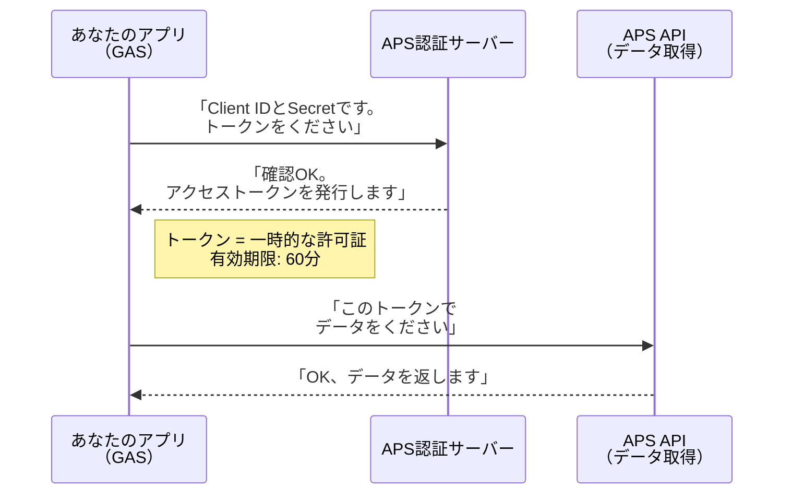

### 2-legged認証と3-legged認証の違い

APSのOAuth認証には **2-legged** と **3-legged** の2種類があります。

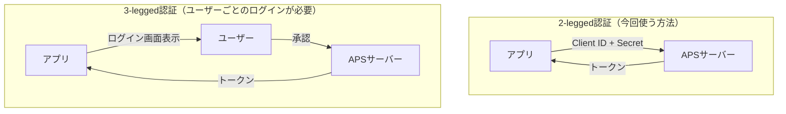

| 比較項目 | 2-legged（Client Credentials） | 3-legged（Authorization Code） |
|---------|-------------------------------|-------------------------------|
| ユーザーのログイン | **不要** | 必要 |
| 利用シーン | サーバー間のバッチ処理 | ユーザーごとの操作 |
| セットアップ | **簡単** | やや複雑 |
| ACCでの必須設定 | カスタムインテグレーション登録 | コールバックURL設定 |
| 今回の採用 | **こちらを使う** | 今回は使わない |

今回は **2-legged認証（Client Credentials Grant）** を使います。理由は以下の通りです。

- ユーザーのログイン操作が不要（バッチ処理向き）
- GASのような定期実行スクリプトと相性が良い
- セットアップが簡単で、最初の一歩に最適

### 認証フローの詳細

2-legged認証のフローをもう少し詳しく見てみましょう。

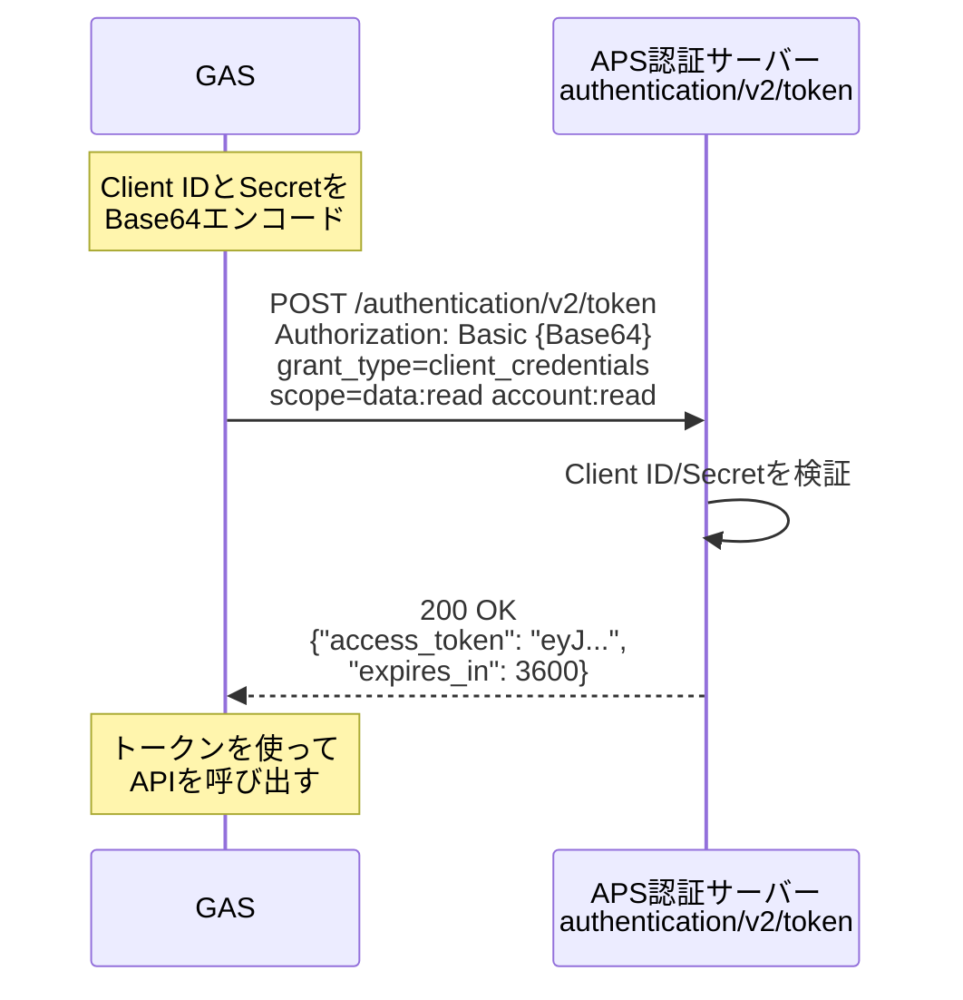

**リクエストに含めるもの**:

| パラメータ | 値 | 説明 |
|-----------|---|------|
| Authorization ヘッダー | `Basic {Base64(ClientID:Secret)}` | 認証情報をBase64エンコード |
| grant_type | `client_credentials` | 2-legged認証であることを示す |
| scope | `data:read account:read` | 要求する権限の範囲 |

**スコープ（scope）** とは、「このトークンでどこまでの操作を許可するか」を決めるものです。

| スコープ | 意味 | 今回必要か |
|---------|------|----------|
| `data:read` | ファイル・フォルダの読み取り | **必要** |
| `data:write` | ファイル・フォルダの更新 | 今回は不要 |
| `data:create` | ファイル・フォルダの新規作成 | 今回は不要 |
| `account:read` | ハブ・プロジェクト情報の読み取り | **必要** |

今回はデータを「読むだけ」なので、`data:read` と `account:read` の2つで十分です。

---

## GASでアクセストークンを取得する

ここからは実際にコードを書いていきます。Google Apps Script（GAS）を使って、APSのアクセストークンを取得しましょう。

### GASプロジェクトの準備

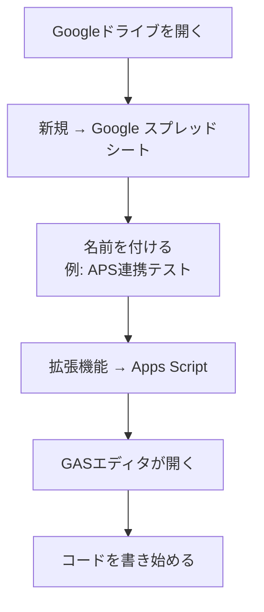

**スプレッドシートの作成は任意です。** 今回はGASのログにAPIの結果を表示するので、スプレッドシートは確認用として使います。

### スクリプトプロパティに機密情報を登録

Client IDやSecretをコードに直接書くのは危険です。GASの**スクリプトプロパティ**に安全に保管しましょう。

```
Apps Script エディタ
└── ⚙️ プロジェクトの設定（左のギアアイコン）
    └── スクリプト プロパティ
        └── 「スクリプト プロパティを追加」
            ├── CLIENT_ID     = （APSポータルのClient ID）
            └── CLIENT_SECRET = （APSポータルのClient Secret）
```

| プロパティ名 | 値 | 備考 |
|-------------|---|------|
| `CLIENT_ID` | APSポータルで取得したID | 英数字の文字列 |
| `CLIENT_SECRET` | APSポータルで取得したSecret | 絶対に外部に漏らさない |

### ステップ1: 設定ファイル（config.gs）

GASエディタの左側の「+」ボタンから新しいスクリプトファイルを作成し、`config` と名前を付けます。

```javascript
// config.gs

/**
 * スクリプトプロパティから設定を取得する
 * 設定方法: Apps Script エディタ → プロジェクトの設定 → スクリプト プロパティ
 */
const CONFIG = {
  get CLIENT_ID() {
    return PropertiesService.getScriptProperties().getProperty('CLIENT_ID');
  },
  get CLIENT_SECRET() {
    return PropertiesService.getScriptProperties().getProperty('CLIENT_SECRET');
  },
  APS_BASE_URL: 'https://developer.api.autodesk.com',
};
```

:::message
`get CLIENT_ID()` という書き方は **ゲッター** と呼ばれるJavaScriptの機能です。`CONFIG.CLIENT_ID` と書くだけで、毎回スクリプトプロパティから最新の値を取得してくれます。
:::

### ステップ2: 認証処理（auth.gs）

新しいファイル `auth` を作成して以下を貼り付けます。

```javascript
// auth.gs

/**
 * 2-legged OAuth2でアクセストークンを取得する
 *
 * 仕組み:
 * 1. Client ID と Secret を「:」で繋げてBase64エンコード
 * 2. それを Authorization ヘッダーに載せて POST
 * 3. レスポンスからトークンを取り出す
 *
 * @returns {string} アクセストークン（有効期限60分）
 */
function getAccessToken() {
  // Client ID と Secret を Base64 エンコード
  const credentials = Utilities.base64Encode(
    CONFIG.CLIENT_ID + ':' + CONFIG.CLIENT_SECRET
  );

  const response = UrlFetchApp.fetch(
    CONFIG.APS_BASE_URL + '/authentication/v2/token',
    {
      method: 'post',
      headers: {
        'Authorization': 'Basic ' + credentials,
        'Content-Type': 'application/x-www-form-urlencoded',
      },
      payload: 'grant_type=client_credentials&scope=data%3Aread%20account%3Aread',
      muteHttpExceptions: true, // エラーでも例外を投げずレスポンスを返す
    }
  );

  const code = response.getResponseCode();
  const body = response.getContentText();

  if (code !== 200) {
    Logger.log('認証エラー [' + code + ']: ' + body);
    throw new Error('トークン取得に失敗しました。Client IDとSecretを確認してください。');
  }

  const result = JSON.parse(body);
  Logger.log('トークン取得成功（有効期限: ' + result.expires_in + '秒）');
  return result.access_token;
}

/**
 * 動作確認用: トークンを取得してログに表示する
 * GASエディタで「testAuth」を選択して実行ボタンを押す
 */
function testAuth() {
  try {
    const token = getAccessToken();
    // セキュリティのためトークンの先頭20文字だけ表示
    Logger.log('取得したトークン: ' + token.substring(0, 20) + '...');
    Logger.log('認証テスト成功！');
  } catch (e) {
    Logger.log('認証テスト失敗: ' + e.message);
  }
}
```

### 認証の動作確認

コードを保存したら、まず認証だけをテストしましょう。

```
GASエディタ
├── 上部の関数選択で「testAuth」を選ぶ
├── ▶️ 実行ボタンをクリック
└── 下部の「実行ログ」で結果を確認
```

**成功した場合のログ**:
```
[INFO] トークン取得成功（有効期限: 3600秒）
[INFO] 取得したトークン: eyJhbGciOiJSUzI1Ni...
[INFO] 認証テスト成功！
```

**失敗した場合のログ**:
```
[INFO] 認証エラー [401]: {"developerMessage":"The client_id/client_secret are not valid."}
[ERROR] トークン取得に失敗しました。Client IDとSecretを確認してください。
```

:::message
初回実行時に「承認が必要です」というダイアログが表示されます。これはGASがインターネットにアクセスする許可を求めるもので、「許可」をクリックしてください。APSの認証とは別の話です。
:::

---

## ハブ一覧・プロジェクト一覧を取得する

アクセストークンが取得できたら、いよいよACCのデータを取得します。

### ACC APIの階層構造

ACCのデータは以下の階層で管理されています。

```
ハブ（Hub）                       ← 組織単位（会社）
└── プロジェクト（Project）         ← ACCの各プロジェクト
    └── トップフォルダ（Top Folder）  ← Project Files / Plans
        └── フォルダ（Folder）       ← ユーザーが作るフォルダ
            └── アイテム（Item）      ← ファイル
```

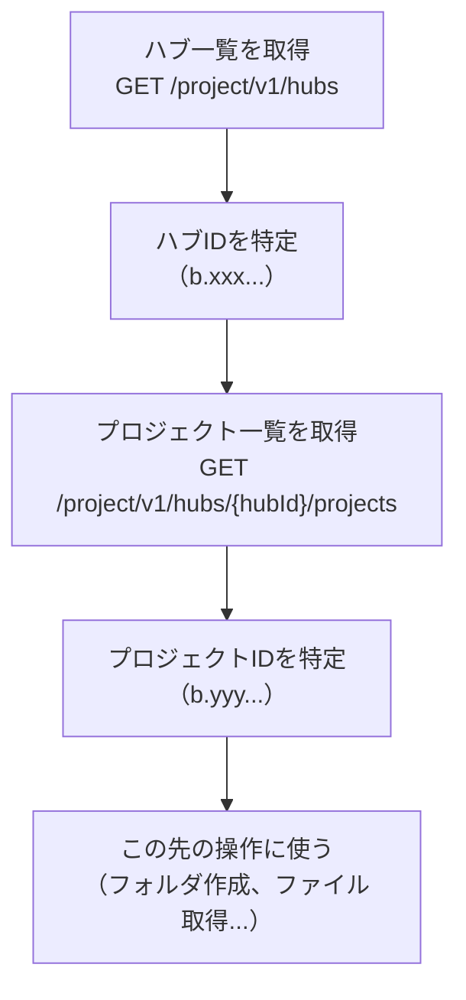

つまり、まず**ハブID**を知り、次にそのハブ内の**プロジェクトID**を知る、という2段階のステップが必要です。

### ステップ3: API呼び出し（api.gs）

新しいファイル `api` を作成して以下を貼り付けます。

```javascript
// api.gs

/**
 * ハブ（組織）一覧を取得する
 * ハブ = Autodesk上の「組織」単位。通常は会社ごとに1つ。
 *
 * @param {string} token - アクセストークン
 * @returns {Array} ハブ情報の配列
 */
function getHubs(token) {
  const url = CONFIG.APS_BASE_URL + '/project/v1/hubs';

  const response = UrlFetchApp.fetch(url, {
    method: 'get',
    headers: {
      'Authorization': 'Bearer ' + token,
    },
    muteHttpExceptions: true,
  });

  const code = response.getResponseCode();
  const body = response.getContentText();

  if (code !== 200) {
    Logger.log('ハブ取得エラー [' + code + ']: ' + body);
    throw new Error('ハブ一覧の取得に失敗しました。');
  }

  return JSON.parse(body);
}

/**
 * 指定したハブ内のプロジェクト一覧を取得する
 *
 * @param {string} token - アクセストークン
 * @param {string} hubId - ハブID（b.xxx...形式）
 * @returns {Array} プロジェクト情報の配列
 */
function getProjects(token, hubId) {
  const url = CONFIG.APS_BASE_URL + '/project/v1/hubs/' + hubId + '/projects';

  const response = UrlFetchApp.fetch(url, {
    method: 'get',
    headers: {
      'Authorization': 'Bearer ' + token,
    },
    muteHttpExceptions: true,
  });

  const code = response.getResponseCode();
  const body = response.getContentText();

  if (code !== 200) {
    Logger.log('プロジェクト取得エラー [' + code + ']: ' + body);
    throw new Error('プロジェクト一覧の取得に失敗しました。');
  }

  return JSON.parse(body);
}
```

### ステップ4: メイン処理（main.gs）

既存の `Code.gs`（デフォルトファイル）を以下に書き換えます。

```javascript
// main.gs（Code.gs を書き換える）

/**
 * メイン処理: ハブ一覧とプロジェクト一覧を取得してログに表示する
 * GASエディタで「main」を選択して▶️実行
 */
function main() {
  Logger.log('===== APS API 動作テスト =====');

  // ── 1. アクセストークンを取得 ──
  Logger.log('');
  Logger.log('【ステップ1】トークンを取得中...');
  const token = getAccessToken();
  Logger.log('トークン取得OK');

  // ── 2. ハブ一覧を取得 ──
  Logger.log('');
  Logger.log('【ステップ2】ハブ一覧を取得中...');
  const hubsResponse = getHubs(token);
  const hubs = hubsResponse.data;

  Logger.log('取得したハブ数: ' + hubs.length);
  Logger.log('');

  hubs.forEach(function (hub, index) {
    Logger.log('── ハブ ' + (index + 1) + ' ──');
    Logger.log('  名前:   ' + hub.attributes.name);
    Logger.log('  ID:     ' + hub.id);
    Logger.log('  リージョン: ' + hub.attributes.region);
    Logger.log('');
  });

  // ── 3. 最初のハブのプロジェクト一覧を取得 ──
  if (hubs.length === 0) {
    Logger.log('ハブが見つかりません。ACCカスタムインテグレーションの登録を確認してください。');
    return;
  }

  const hubId = hubs[0].id;
  Logger.log('【ステップ3】プロジェクト一覧を取得中...');
  Logger.log('対象ハブ: ' + hubs[0].attributes.name + ' (' + hubId + ')');
  Logger.log('');

  const projectsResponse = getProjects(token, hubId);
  const projects = projectsResponse.data;

  Logger.log('取得したプロジェクト数: ' + projects.length);
  Logger.log('');

  projects.forEach(function (project, index) {
    Logger.log('── プロジェクト ' + (index + 1) + ' ──');
    Logger.log('  名前:       ' + project.attributes.name);
    Logger.log('  ID:         ' + project.id);
    Logger.log('  ステータス:  ' + project.attributes.status);
    Logger.log('  タイプ:      ' + project.attributes.extension.type);
    Logger.log('');
  });

  Logger.log('===== 完了 =====');
  Logger.log('');
  Logger.log('次のステップ:');
  Logger.log('使いたいプロジェクトのIDをメモして、');
  Logger.log('スクリプトプロパティの PROJECT_ID に設定してください。');
}
```

### 実行結果の例

`main` を実行すると、ログに以下のような出力が表示されます。

```
===== APS API 動作テスト =====

【ステップ1】トークンを取得中...
トークン取得OK

【ステップ2】ハブ一覧を取得中...
取得したハブ数: 1

── ハブ 1 ──
  名前:   株式会社サンプル建設
  ID:     b.a1b2c3d4-e5f6-7890-abcd-ef1234567890
  リージョン: US

【ステップ3】プロジェクト一覧を取得中...
対象ハブ: 株式会社サンプル建設 (b.a1b2c3d4-...)

取得したプロジェクト数: 3

── プロジェクト 1 ──
  名前:       東京駅前再開発プロジェクト
  ID:         b.f1e2d3c4-b5a6-7890-fedc-ba0987654321
  ステータス:  active
  タイプ:      projects:autodesk.bim360:Project

── プロジェクト 2 ──
  名前:       大阪支店ビル改修工事
  ID:         b.11223344-5566-7788-99aa-bbccddeeff00
  ステータス:  active
  タイプ:      projects:autodesk.bim360:Project

===== 完了 =====

次のステップ:
使いたいプロジェクトのIDをメモして、
スクリプトプロパティの PROJECT_ID に設定してください。
```

---

## レスポンスの読み方（JSON:API形式）

APIから返ってくるデータは **JSON:API** という標準的な形式に従っています。初めて見ると少し複雑に見えますが、構造を理解すれば読み解けます。

### JSON:API の基本構造

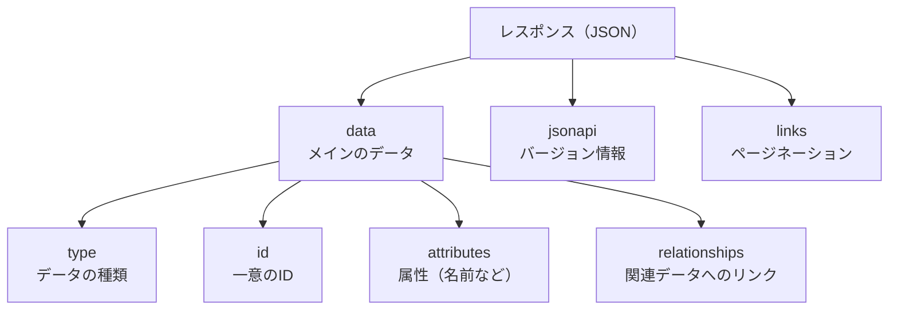

### ハブ一覧のレスポンス例

実際のレスポンスを見てみましょう。重要な部分だけ抜粋します。

```javascript
// GET /project/v1/hubs のレスポンス
{
  "jsonapi": { "version": "1.0" },  // ← JSON:APIのバージョン
  "data": [                          // ← メインのデータ（配列）
    {
      "type": "hubs",               // ← データの種類（ハブ）
      "id": "b.a1b2c3d4-...",       // ← ハブの一意ID
      "attributes": {               // ← ハブの属性情報
        "name": "株式会社サンプル建設",  // ← 表示名
        "region": "US",              // ← データセンターのリージョン
        "extension": {
          "type": "hubs:autodesk.bim360:Account"  // ← BIM 360/ACC のハブ
        }
      }
    }
  ]
}
```

### プロジェクト一覧のレスポンス例

```javascript
// GET /project/v1/hubs/{hub_id}/projects のレスポンス
{
  "jsonapi": { "version": "1.0" },
  "data": [
    {
      "type": "projects",             // ← データの種類（プロジェクト）
      "id": "b.f1e2d3c4-...",         // ← プロジェクトの一意ID
      "attributes": {
        "name": "東京駅前再開発プロジェクト",  // ← プロジェクト名
        "status": "active",           // ← ステータス（active / inactive）
        "extension": {
          "type": "projects:autodesk.bim360:Project"
        }
      },
      "relationships": {             // ← 関連データ
        "hub": {
          "data": {
            "type": "hubs",
            "id": "b.a1b2c3d4-..."   // ← 所属するハブのID
          }
        }
      }
    }
  ]
}
```

### JSON:API のデータを取り出すパターン

GASでよく使うデータの取り出し方をまとめます。

| 取得したいもの | コード | 例 |
|-------------|-------|---|
| ハブの名前 | `hub.attributes.name` | 株式会社サンプル建設 |
| ハブのID | `hub.id` | b.a1b2c3d4-... |
| プロジェクトの名前 | `project.attributes.name` | 東京駅前再開発 |
| プロジェクトのID | `project.id` | b.f1e2d3c4-... |
| プロジェクトの状態 | `project.attributes.status` | active |
| 所属ハブのID | `project.relationships.hub.data.id` | b.a1b2c3d4-... |

### IDの形式について

APS/ACCで使われるIDには特徴的なパターンがあります。

| ID形式 | 対象 | 例 |
|--------|------|---|
| `b.{UUID}` | ハブ、プロジェクト | `b.a1b2c3d4-e5f6-...` |
| `urn:adsk.wipprod:dm.lineage:{UUID}` | ファイル | `urn:adsk.wipprod:dm.lineage:abc123` |
| `urn:adsk.wipprod:fs.folder:{UUID}` | フォルダ | `urn:adsk.wipprod:fs.folder:co.xyz` |

`b.` で始まるIDはBIM 360/ACC固有のプレフィックスです。APIに渡すときはこのプレフィックスを含めたまま使います。

---

## ページネーション（大量データの取得）

プロジェクトが多数ある場合、1回のAPIコールではすべて取得できないことがあります。JSON:APIでは**ページネーション**（ページ分割）が使われます。

### ページネーションの仕組み

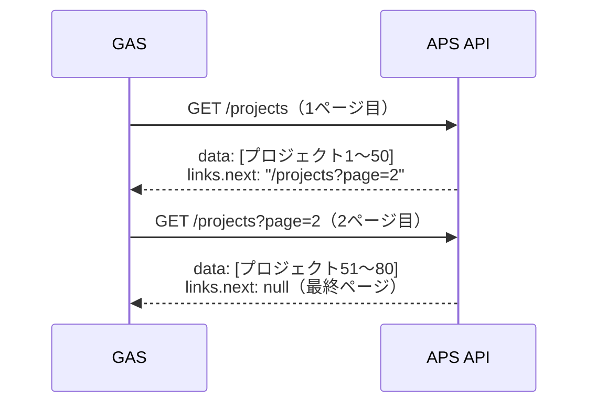

### ページネーション対応コード

プロジェクト数が多い場合に備えて、全ページを取得するヘルパー関数を用意しましょう。`api.gs` に以下を追加します。

```javascript
// api.gs に追加

/**
 * ページネーション対応: 全プロジェクトを取得する
 * レスポンスに links.next がある限り次のページを取得し続ける
 *
 * @param {string} token - アクセストークン
 * @param {string} hubId - ハブID
 * @returns {Array} 全プロジェクトの配列
 */
function getAllProjects(token, hubId) {
  var allProjects = [];
  var url = CONFIG.APS_BASE_URL + '/project/v1/hubs/' + hubId + '/projects';

  while (url) {
    var response = UrlFetchApp.fetch(url, {
      method: 'get',
      headers: {
        'Authorization': 'Bearer ' + token,
      },
      muteHttpExceptions: true,
    });

    if (response.getResponseCode() !== 200) {
      throw new Error('プロジェクト取得エラー: ' + response.getContentText());
    }

    var result = JSON.parse(response.getContentText());
    allProjects = allProjects.concat(result.data);

    // 次のページがあればURLを更新、なければループ終了
    url = result.links && result.links.next ? result.links.next : null;

    if (url) {
      Logger.log('次のページを取得中... (現在 ' + allProjects.length + '件)');
      Utilities.sleep(200); // レート制限対策
    }
  }

  return allProjects;
}
```

---

## プロジェクト一覧をスプレッドシートに表示する

ログだけでなく、スプレッドシートにプロジェクト一覧を書き出す機能も追加しましょう。結果が見やすくなり、プロジェクトIDのコピーも簡単です。

### スプレッドシート出力コード

`main.gs` に以下の関数を追加します。

```javascript
// main.gs に追加

/**
 * プロジェクト一覧をスプレッドシートの「プロジェクト一覧」シートに書き出す
 */
function exportProjectsToSheet() {
  Logger.log('プロジェクト一覧をシートに出力します...');

  const token = getAccessToken();
  const hubsResponse = getHubs(token);

  if (hubsResponse.data.length === 0) {
    Logger.log('ハブが見つかりません。');
    return;
  }

  const hub = hubsResponse.data[0];
  const hubId = hub.id;
  Logger.log('ハブ: ' + hub.attributes.name);

  // 全プロジェクトを取得
  const projects = getAllProjects(token, hubId);
  Logger.log('プロジェクト数: ' + projects.length);

  // シートを準備
  const ss = SpreadsheetApp.getActiveSpreadsheet();
  var sheet = ss.getSheetByName('プロジェクト一覧');
  if (!sheet) {
    sheet = ss.insertSheet('プロジェクト一覧');
  }
  sheet.clear();

  // ヘッダー行
  var headers = ['No.', 'プロジェクト名', 'プロジェクトID', 'ステータス', 'タイプ'];
  sheet.getRange(1, 1, 1, headers.length).setValues([headers]);
  sheet.getRange(1, 1, 1, headers.length)
    .setFontWeight('bold')
    .setBackground('#4472C4')
    .setFontColor('#FFFFFF');

  // データ行
  var rows = projects.map(function (project, index) {
    return [
      index + 1,
      project.attributes.name,
      project.id,
      project.attributes.status,
      project.attributes.extension.type,
    ];
  });

  if (rows.length > 0) {
    sheet.getRange(2, 1, rows.length, headers.length).setValues(rows);
  }

  // 列幅を自動調整
  headers.forEach(function (_, i) {
    sheet.autoResizeColumn(i + 1);
  });

  Logger.log('シートへの出力が完了しました。');
}
```

### 出力結果のイメージ

| No. | プロジェクト名 | プロジェクトID | ステータス | タイプ |
|-----|-------------|-------------|----------|------|
| 1 | 東京駅前再開発プロジェクト | b.f1e2d3c4-b5a6-... | active | projects:autodesk.bim360:Project |
| 2 | 大阪支店ビル改修工事 | b.11223344-5566-... | active | projects:autodesk.bim360:Project |
| 3 | 名古屋物流センター | b.aabbccdd-eeff-... | inactive | projects:autodesk.bim360:Project |

---

## GASファイル構成のまとめ

最終的なファイル構成は以下の通りです。

```
Apps Script プロジェクト
├── config.gs    ← 設定値の管理
├── auth.gs      ← OAuth認証・トークン取得
├── api.gs       ← API呼び出し（ハブ・プロジェクト取得）
└── Code.gs      ← メイン処理（main, exportProjectsToSheet）
```

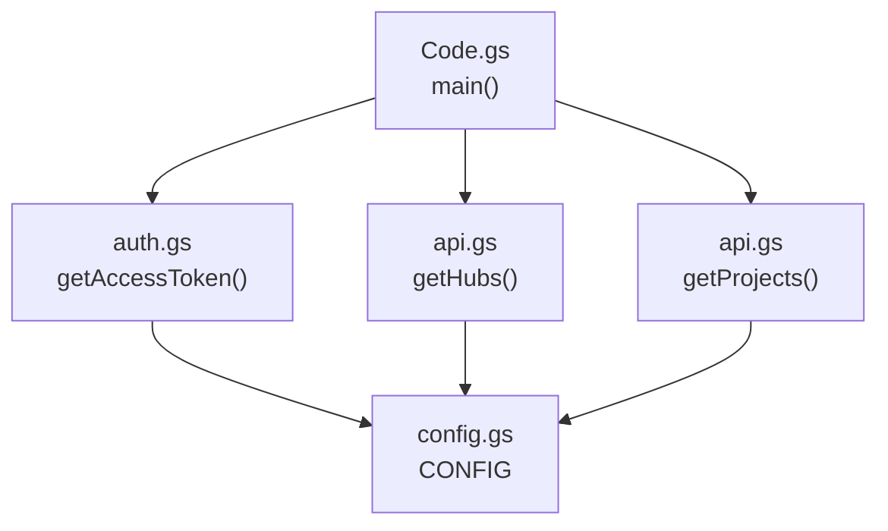

| ファイル | 関数 | 役割 |
|---------|------|------|
| config.gs | CONFIG | スクリプトプロパティから設定を読み込む |
| auth.gs | getAccessToken() | 2-legged OAuth2 でトークン取得 |
| auth.gs | testAuth() | 認証の動作確認用 |
| api.gs | getHubs(token) | ハブ一覧を取得 |
| api.gs | getProjects(token, hubId) | プロジェクト一覧を取得 |
| api.gs | getAllProjects(token, hubId) | 全プロジェクトを取得（ページネーション対応） |
| Code.gs | main() | ログにハブ・プロジェクト情報を表示 |
| Code.gs | exportProjectsToSheet() | スプレッドシートにプロジェクト一覧を出力 |

---

## トラブルシューティング

よくあるエラーと対処法をまとめます。

| エラー / 症状 | 原因 | 対処法 |
|-------------|------|-------|
| `401 Unauthorized` | Client ID または Secret が間違っている | スクリプトプロパティの値を再確認 |
| `401 The token is invalid` | トークンの有効期限切れ（60分） | `getAccessToken()` でトークンを再取得 |
| `403 Forbidden` | ACCカスタムインテグレーション未登録 | ACC管理画面でClient IDを登録する |
| `403 You don't have permission` | スコープ不足 | `scope` パラメータに必要なスコープが含まれているか確認 |
| ハブが0件で返ってくる | カスタムインテグレーションが未登録 or 権限なし | ACC管理者にカスタムインテグレーションの登録を依頼 |
| プロジェクトが0件で返ってくる | ハブIDが間違っている / プロジェクトが存在しない | ログで `hub.id` を確認し、ACCの管理画面と照合 |
| `Exception: Request failed` | GASのネットワークエラー | 時間を置いて再実行。改善しなければURL・ペイロードを確認 |
| `SyntaxError: Unexpected token` | JSONパースエラー | APIがHTMLエラーページを返している可能性。ステータスコードを確認 |

### 403エラーのデバッグフロー

403エラーは最もよくある問題です。以下のフローで原因を特定してください。

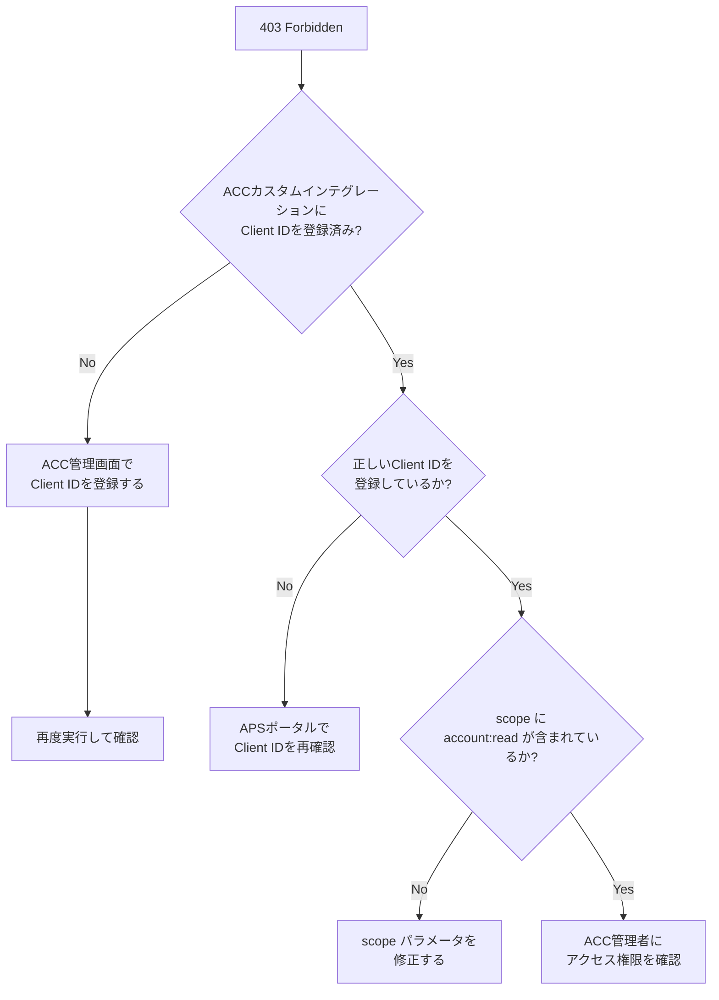

### 認証がうまくいかないときのチェックリスト

```
□ APSポータル（aps.autodesk.com）でアプリを作成済みか？
□ Client ID をコピペミスなく設定したか？（前後にスペースがないか）
□ Client Secret をコピペミスなく設定したか？
□ スクリプトプロパティの「キー名」が CLIENT_ID / CLIENT_SECRET か？
□ ACCカスタムインテグレーションに登録済みか？
□ ACC管理者権限でインテグレーションを追加したか？
□ GASの初回実行で Google の承認画面を「許可」したか？
```

---

## まとめ

この記事で学んだことを振り返ります。

```
✅ APSとは何か（旧Forge → APSへのリブランド）
✅ APSアプリを登録してClient ID / Secretを取得する方法
✅ OAuth 2.0 の 2-legged認証の仕組みと実装
✅ GASでアクセストークンを取得するコード
✅ ハブ一覧・プロジェクト一覧を取得するAPI呼び出し
✅ JSON:API形式のレスポンスの読み方
✅ ページネーション対応の実装
✅ プロジェクト一覧をスプレッドシートに出力する応用
```

**今回のコードで取得したプロジェクトID** が、次の記事で使う重要な情報になります。スクリプトプロパティの `PROJECT_ID` に保存しておいてください。

### 次のステップ

次の記事では、今回取得したプロジェクトIDを使って、**ACCにフォルダ構成を一括作成する** 仕組みを作ります。

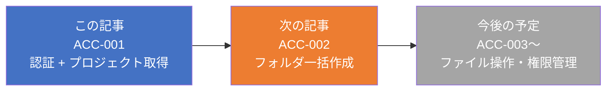

👉 **次の記事: [GASでACCのフォルダ構成を一括作成する ― Data Management APIとスプレッドシート連携](./acc-002-gas-acc-folder-creation)**

---

## 参考リンク

- [APS 公式ポータル](https://aps.autodesk.com/)
- [APS 認証 v2 ドキュメント](https://aps.autodesk.com/en/docs/oauth/v2/overview/)
- [GET hubs リファレンス](https://aps.autodesk.com/en/docs/data/v2/reference/http/hubs-GET/)
- [GET hubs/:hub_id/projects リファレンス](https://aps.autodesk.com/en/docs/data/v2/reference/http/hubs-hub_id-projects-GET/)
- [JSON:API 仕様](https://jsonapi.org/)
- [Google Apps Script UrlFetchApp](https://developers.google.com/apps-script/reference/url-fetch/url-fetch-app)
- [Forge → APS リブランドの公式アナウンス](https://aps.autodesk.com/blog/forge-is-now-autodesk-platform-services)
