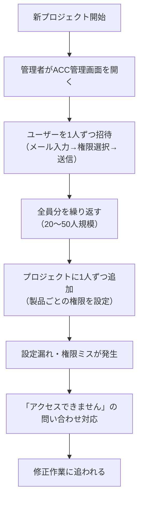
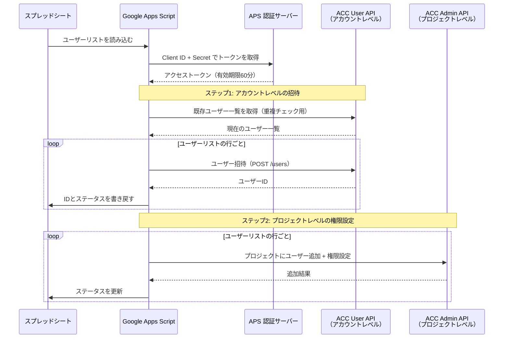
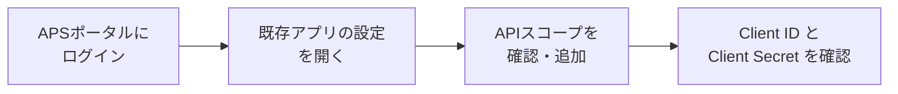
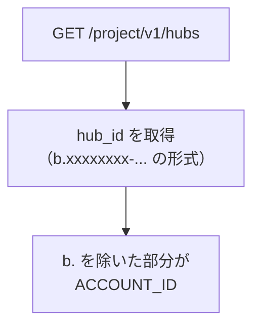
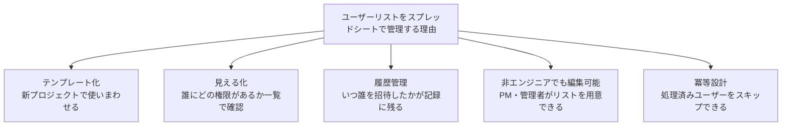
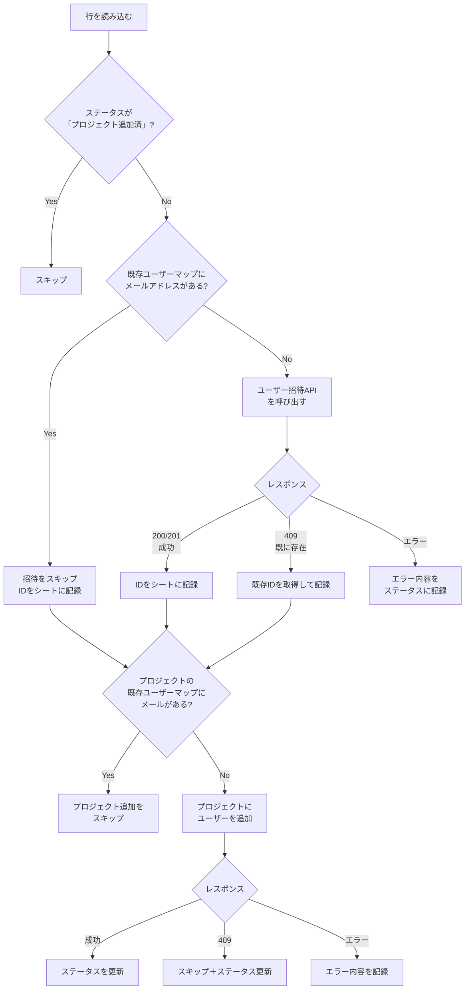
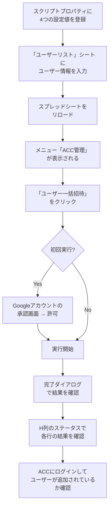
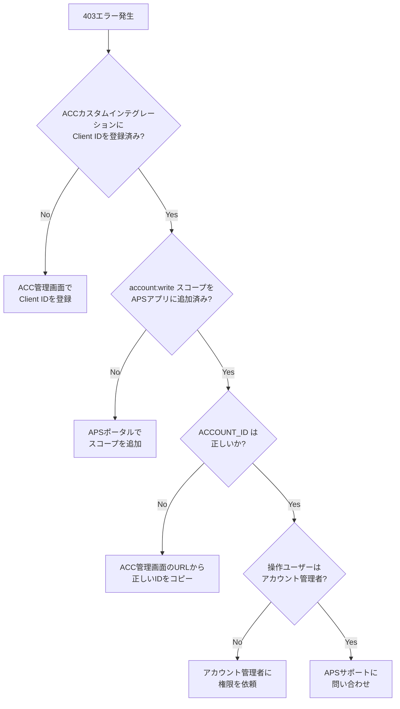
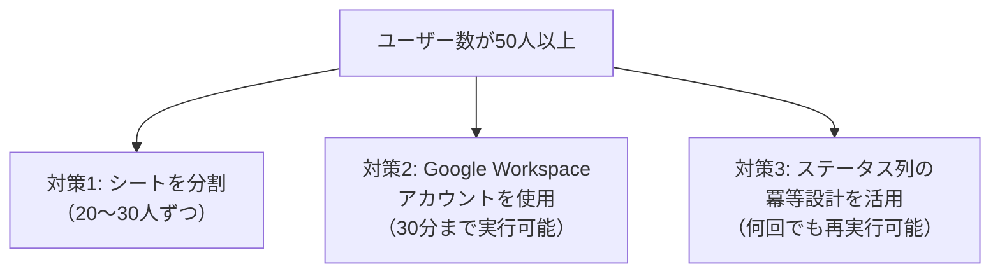

## はじめに

新しいACCプロジェクトが始まるたびに、関係者を1人ずつ招待して、権限を設定して...という作業を繰り返していませんか？

「建築チーム10名、構造チーム5名、設備チーム8名、それぞれにDocs権限とModel Coordination権限を...」。管理画面のユーザー招待を何十回もクリックするのは、ミスも起きやすく非常に手間のかかる作業です。

この記事では、**Google Apps Script（GAS）** と **ACC Admin API（User Management）** を使って、Googleスプレッドシートに書いたユーザーリストをACCに一括招待し、プロジェクトごとの権限も自動設定する仕組みを作ります。

**この記事でできること**:
- スプレッドシートでユーザーリスト（メール・権限・プロジェクト）を管理
- ボタン1クリックでACCにユーザーを一括招待
- プロジェクトレベルの権限（Docs/Build/Model Coordination等）を自動設定
- 再実行しても壊れない冪等（べきとう）な設計

**対象読者**: ACCを業務で使っている管理者・BIM担当者（プログラミング初〜中級）
**前提条件**: Googleアカウント・ACCアカウント管理者権限・APSデベロッパーアカウントがあること
**所要時間**: 約60〜90分

:::message
**シリーズ記事**
この記事は ACC × GAS 自動化シリーズの第3回です。
- [ACC-001: APS OAuth認証入門](https://zenn.dev/) ← 認証の基本
- [ACC-002: GASでACCのフォルダ構成を一括作成する](https://zenn.dev/) ← フォルダ自動化
- **ACC-003: GASでACCのユーザー管理を自動化する** ← 今回の記事
:::

---

## 完成イメージ

スプレッドシートにこんなリストを書いたら...

**「ユーザーリスト」シート**:

| メールアドレス | 会社名 | アクセスレベル | Docs権限 | Build権限 | MC権限 | ユーザーID | ステータス |
|-------------|--------|-------------|---------|----------|-------|----------|----------|
| tanaka@example.com | A建設 | project_admin | administrator | user | user | | 未処理 |
| suzuki@example.com | B設計 | user | user | none | administrator | | 未処理 |
| sato@example.com | C設備 | user | user | none | user | | 未処理 |

GASを実行すると、全員がACCに招待され、シートが更新されます。

| メールアドレス | 会社名 | アクセスレベル | Docs権限 | Build権限 | MC権限 | ユーザーID | ステータス |
|-------------|--------|-------------|---------|----------|-------|----------|----------|
| tanaka@example.com | A建設 | project_admin | administrator | user | user | abc123... | 招待済+プロジェクト追加済 |
| suzuki@example.com | B設計 | user | user | none | administrator | def456... | 招待済+プロジェクト追加済 |
| sato@example.com | C設備 | user | user | none | user | ghi789... | 招待済+プロジェクト追加済 |

---

## ACCのユーザー管理の課題を整理する

まず、なぜ自動化が必要なのかを整理しましょう。

### 手動管理の問題点



### 手動 vs 自動化の比較

| 項目 | 手動（管理画面） | 自動化（GAS + API） |
|------|----------------|-------------------|
| 20人の招待にかかる時間 | 約30〜40分 | 約2〜3分 |
| 権限設定ミスのリスク | 高い（目視確認のみ） | 低い（スプレッドシートで一覧管理） |
| テンプレート再利用 | 不可（毎回手作業） | 可能（シートをコピーするだけ） |
| 作業記録 | 残らない | スプレッドシートに自動記録 |
| 複数プロジェクトへの展開 | プロジェクトごとに繰り返し | PROJECT_IDを変えて再実行 |

---

## 全体の仕組みを理解する

ユーザー管理の自動化には**2つのステップ**があります。



**なぜ2段階なのか？**

ACCのユーザー管理は2つの階層に分かれています。

```
ACCアカウント（会社全体）
├── ユーザー管理 ← ステップ1: ここに招待する
│   ├── tanaka@example.com（project_admin）
│   ├── suzuki@example.com（user）
│   └── sato@example.com（user）
│
└── プロジェクト
    ├── 東京駅前ビル新築工事 ← ステップ2: ここに追加する
    │   ├── tanaka@example.com（Docs: admin, Build: user）
    │   └── suzuki@example.com（Docs: user, MC: admin）
    │
    └── 大阪本社改修工事
        ├── tanaka@example.com（Docs: admin）
        └── sato@example.com（Docs: user, Build: user）
```

1. **アカウントレベル**: まず会社のACCアカウントにユーザーを招待する
2. **プロジェクトレベル**: 次に、特定のプロジェクトにユーザーを追加し、製品ごとの権限を設定する

---

## 事前準備

### 1. APSアプリの設定を確認する

ACC-002でAPSアプリを作成済みの場合は、スコープの追加だけで済みます。



**必要なスコープ（ACC-002から追加が必要なもの）**:

| スコープ | 必要な理由 | ACC-002で設定済み？ |
|---------|-----------|-------------------|
| `account:read` | ユーザー一覧・アカウント情報の読み取り | 設定済み |
| `account:write` | ユーザーの招待・権限更新 | **追加が必要** |
| `data:read` | プロジェクト情報の読み取り | 設定済み |

:::message alert
**`account:write` スコープが新たに必要です。** APSポータルでアプリの設定を開き、このスコープを追加してください。追加しないと招待APIが `403 Forbidden` を返します。
:::

### 2. ACCカスタムインテグレーションの確認

ACC-002で登録済みの場合は、追加作業は不要です。

```
ACC管理画面
└── アカウント管理
    └── カスタムインテグレーション
        └── Client IDが登録されていることを確認
```

### 3. 必要な情報を確認する

以下の情報をスクリプトプロパティに設定します。

| 変数名 | 内容 | 取得方法 |
|-------|------|---------|
| `CLIENT_ID` | APSアプリのID | APSポータルで確認 |
| `CLIENT_SECRET` | APSアプリのシークレット | APSポータルで確認 |
| `ACCOUNT_ID` | ACCアカウントのID | ACC管理画面のURLから取得 |
| `PROJECT_ID` | ACCプロジェクトのID | API経由で取得 |

**ACCOUNT_IDの取得方法**:

ACC管理画面のURLに含まれています。

```
https://acc.autodesk.com/admin/accounts/xxxxxxxx-xxxx-xxxx-xxxx-xxxxxxxxxxxx/settings
                                        └──────────── これがACCOUNT_ID ──────────────┘
```

または、API経由でも取得できます。



---

## スプレッドシートを設計する

### シートの構成

「ユーザーリスト」というシート名で以下の列を用意します。

```
A列: メールアドレス（必須）
B列: 会社名
C列: アクセスレベル（account_admin / project_admin / user）
D列: Docs権限（administrator / user / none）
E列: Build権限（administrator / user / none）
F列: Model Coordination権限（administrator / user / none）
G列: ユーザーID（GASが自動入力）
H列: ステータス（GASが自動入力）
```

### 記入例

| A（メール） | B（会社名） | C（レベル） | D（Docs） | E（Build） | F（MC） | G（ID） | H（ステータス） |
|-----------|-----------|-----------|---------|----------|-------|-------|-------------|
| tanaka@a-kensetsu.co.jp | A建設 | project_admin | administrator | user | user | | |
| suzuki@b-sekkei.co.jp | B設計事務所 | user | user | none | administrator | | |
| yamada@b-sekkei.co.jp | B設計事務所 | user | user | none | user | | |
| sato@c-setsubi.co.jp | C設備 | user | user | none | user | | |
| ito@a-kensetsu.co.jp | A建設 | user | user | user | none | | |

### アクセスレベルと製品権限の説明

**C列: アクセスレベル（アカウント全体の役割）**

| 値 | 意味 | 使う場面 |
|----|------|---------|
| `account_admin` | アカウント管理者 | IT担当者・ACC全体管理者 |
| `project_admin` | プロジェクト管理者 | プロジェクトマネージャー・BIM管理者 |
| `user` | 一般ユーザー | 設計者・施工担当者・協力会社 |

**D〜F列: 製品ごとの権限（プロジェクト内の役割）**

| 値 | 意味 |
|----|------|
| `administrator` | その製品の管理者（設定変更・ユーザー管理が可能） |
| `user` | その製品の一般利用者（閲覧・編集が可能） |
| `none` | その製品へのアクセスなし |

### なぜスプレッドシートで管理するのか



---

## GASコードを実装する

GASエディタを開き（スプレッドシートの「拡張機能」→「Apps Script」）、以下のコードを順番に追加します。

### ステップ1: 設定ファイル（config.gs）

```javascript
// config.gs

/**
 * スクリプトプロパティから設定を取得する
 * 設定方法: Apps Script エディタ → プロジェクトの設定 → スクリプト プロパティ
 * キー名: CLIENT_ID, CLIENT_SECRET, ACCOUNT_ID, PROJECT_ID
 */
const CONFIG = {
  get CLIENT_ID()     { return PropertiesService.getScriptProperties().getProperty('CLIENT_ID'); },
  get CLIENT_SECRET() { return PropertiesService.getScriptProperties().getProperty('CLIENT_SECRET'); },
  get ACCOUNT_ID()    { return PropertiesService.getScriptProperties().getProperty('ACCOUNT_ID'); },
  get PROJECT_ID()    { return PropertiesService.getScriptProperties().getProperty('PROJECT_ID'); },
  SHEET_NAME: 'ユーザーリスト',
  APS_BASE_URL: 'https://developer.api.autodesk.com',
};

// スプレッドシートの列番号の定義（読みやすさのために定数化）
const COL = {
  EMAIL: 1,        // A列
  COMPANY: 2,      // B列
  ACCESS_LEVEL: 3, // C列
  DOCS: 4,         // D列
  BUILD: 5,        // E列
  MC: 6,           // F列
  USER_ID: 7,      // G列
  STATUS: 8,       // H列
};
```

**スクリプトプロパティへの登録手順**:

```
Apps Script エディタ
└── ⚙️ プロジェクトの設定
    └── スクリプト プロパティ
        ├── CLIENT_ID      = （APSのClient ID）
        ├── CLIENT_SECRET   = （APSのClient Secret）
        ├── ACCOUNT_ID      = xxxxxxxx-xxxx-xxxx-xxxx-xxxxxxxxxxxx
        └── PROJECT_ID      = xxxxxxxx-xxxx-xxxx-xxxx-xxxxxxxxxxxx
```

:::message
**PROJECT_IDの注意**: ここでは `b.` プレフィックスを**つけない**UUIDを設定してください。ACC Admin APIでは `b.` なしのIDを使用します（ACC-002のData Management APIとは異なります）。
:::

### ステップ2: 認証（auth.gs）

ACC-002と同じ認証方式です。スコープだけ変更します。

```javascript
// auth.gs

/**
 * 2-legged OAuth2でアクセストークンを取得する
 * ユーザー管理には account:read と account:write が必要
 */
function getAccessToken() {
  const credentials = Utilities.base64Encode(
    CONFIG.CLIENT_ID + ':' + CONFIG.CLIENT_SECRET
  );

  const response = UrlFetchApp.fetch(
    CONFIG.APS_BASE_URL + '/authentication/v2/token',
    {
      method: 'post',
      headers: {
        'Authorization': 'Basic ' + credentials,
        'Content-Type': 'application/x-www-form-urlencoded'
      },
      payload: 'grant_type=client_credentials' +
               '&scope=account%3Aread%20account%3Awrite%20data%3Aread',
      muteHttpExceptions: true
    }
  );

  if (response.getResponseCode() !== 200) {
    throw new Error('トークン取得失敗: ' + response.getContentText());
  }

  const token = JSON.parse(response.getContentText()).access_token;
  Logger.log('トークンを取得しました');
  return token;
}
```

### ステップ3: ユーザー一覧取得（users.gs）

冪等設計の要となる「既存ユーザーチェック」の関数です。

```javascript
// users.gs

/**
 * アカウントの既存ユーザーを全件取得する
 * ページネーションに対応（1回100件ずつ取得）
 *
 * @param {string} token - アクセストークン
 * @returns {Object} メールアドレスをキーにしたユーザー情報のマップ
 *   例: { "tanaka@example.com": { id: "xxx", status: "active", ... }, ... }
 */
function getAllExistingUsers(token) {
  const userMap = {};
  let offset = 0;
  const limit = 100;
  let hasMore = true;

  while (hasMore) {
    const url = `${CONFIG.APS_BASE_URL}/hq/v1/accounts/${CONFIG.ACCOUNT_ID}/users`
              + `?limit=${limit}&offset=${offset}`;

    const response = UrlFetchApp.fetch(url, {
      headers: { 'Authorization': 'Bearer ' + token },
      muteHttpExceptions: true
    });

    if (response.getResponseCode() !== 200) {
      throw new Error('ユーザー一覧取得失敗: ' + response.getContentText());
    }

    const users = JSON.parse(response.getContentText());

    // 取得結果が空ならループ終了
    if (users.length === 0) {
      hasMore = false;
      break;
    }

    // メールアドレスをキーにしてマップに追加
    users.forEach(user => {
      userMap[user.email.toLowerCase()] = {
        id: user.id,
        status: user.status,
        access_level: user.access_level,
        name: user.name || ''
      };
    });

    offset += limit;

    // API呼び出し間隔を空ける
    Utilities.sleep(300);
  }

  Logger.log(`既存ユーザー数: ${Object.keys(userMap).length}名`);
  return userMap;
}

/**
 * プロジェクトの既存ユーザーを全件取得する
 *
 * @param {string} token - アクセストークン
 * @returns {Object} メールアドレスをキーにしたプロジェクトユーザー情報のマップ
 */
function getProjectUsers(token) {
  const userMap = {};
  let offset = 0;
  const limit = 100;
  let hasMore = true;

  while (hasMore) {
    const url = `${CONFIG.APS_BASE_URL}/construction/admin/v1/projects/${CONFIG.PROJECT_ID}/users`
              + `?limit=${limit}&offset=${offset}`;

    const response = UrlFetchApp.fetch(url, {
      headers: { 'Authorization': 'Bearer ' + token },
      muteHttpExceptions: true
    });

    if (response.getResponseCode() !== 200) {
      throw new Error('プロジェクトユーザー取得失敗: ' + response.getContentText());
    }

    const result = JSON.parse(response.getContentText());
    const users = result.results || result;

    if (!users || users.length === 0) {
      hasMore = false;
      break;
    }

    users.forEach(user => {
      if (user.email) {
        userMap[user.email.toLowerCase()] = {
          id: user.id,
          products: user.products || []
        };
      }
    });

    offset += limit;
    Utilities.sleep(300);
  }

  Logger.log(`プロジェクト既存ユーザー数: ${Object.keys(userMap).length}名`);
  return userMap;
}
```

### ステップ4: ユーザー招待（invite.gs）

アカウントレベルでユーザーを招待する関数です。

```javascript
// invite.gs

/**
 * ACCアカウントにユーザーを1人招待する
 *
 * @param {string} token       - アクセストークン
 * @param {string} email       - 招待するユーザーのメールアドレス
 * @param {string} companyName - 会社名
 * @param {string} accessLevel - アクセスレベル（account_admin / project_admin / user）
 * @returns {Object} { success: boolean, userId: string, message: string }
 */
function inviteUser(token, email, companyName, accessLevel) {
  const url = `${CONFIG.APS_BASE_URL}/hq/v1/accounts/${CONFIG.ACCOUNT_ID}/users`;

  const body = {
    email: email,
    company_name: companyName,
    access_level: accessLevel || 'user'
  };

  const response = UrlFetchApp.fetch(url, {
    method: 'post',
    headers: {
      'Authorization': 'Bearer ' + token,
      'Content-Type': 'application/json'
    },
    payload: JSON.stringify(body),
    muteHttpExceptions: true
  });

  const code = response.getResponseCode();
  const responseBody = JSON.parse(response.getContentText());

  // レート制限（429）の場合はリトライ
  if (code === 429) {
    const retryAfter = (response.getHeaders()['Retry-After'] || 60) * 1000;
    Logger.log(`レート制限。${retryAfter / 1000}秒後にリトライ...`);
    Utilities.sleep(retryAfter);
    return inviteUser(token, email, companyName, accessLevel);
  }

  // 既に招待済み（409 Conflict）
  if (code === 409) {
    Logger.log(`"${email}" は既に招待済みです。スキップします。`);
    return {
      success: true,
      userId: null,  // 既存ユーザーのIDは事前取得したマップから取得する
      message: '招待済み（スキップ）'
    };
  }

  // その他のエラー
  if (code < 200 || code >= 300) {
    Logger.log(`招待失敗 "${email}" [${code}]: ${response.getContentText()}`);
    return {
      success: false,
      userId: null,
      message: `エラー [${code}]: ${responseBody.message || responseBody.detail || '不明なエラー'}`
    };
  }

  // 成功
  Logger.log(`"${email}" を招待しました（ID: ${responseBody.id}）`);
  return {
    success: true,
    userId: responseBody.id,
    message: '招待済み'
  };
}
```

### ステップ5: プロジェクトへのユーザー追加（project.gs）

招待したユーザーをプロジェクトに追加し、製品ごとの権限を設定する関数です。

```javascript
// project.gs

/**
 * ユーザーをプロジェクトに追加し、製品ごとの権限を設定する
 *
 * @param {string} token       - アクセストークン
 * @param {string} email       - ユーザーのメールアドレス
 * @param {string} docsAccess  - Docs権限（administrator / user / none）
 * @param {string} buildAccess - Build権限（administrator / user / none）
 * @param {string} mcAccess    - Model Coordination権限（administrator / user / none）
 * @returns {Object} { success: boolean, message: string }
 */
function addUserToProject(token, email, docsAccess, buildAccess, mcAccess) {
  const url = `${CONFIG.APS_BASE_URL}/construction/admin/v1/projects/${CONFIG.PROJECT_ID}/users`;

  // 製品権限の配列を組み立てる（noneは除外）
  const products = [];

  if (docsAccess && docsAccess !== 'none') {
    products.push({ key: 'docs', access: docsAccess });
  }
  if (buildAccess && buildAccess !== 'none') {
    products.push({ key: 'build', access: buildAccess });
  }
  if (mcAccess && mcAccess !== 'none') {
    products.push({ key: 'modelCoordination', access: mcAccess });
  }

  const body = {
    email: email,
    products: products
  };

  const response = UrlFetchApp.fetch(url, {
    method: 'post',
    headers: {
      'Authorization': 'Bearer ' + token,
      'Content-Type': 'application/json'
    },
    payload: JSON.stringify(body),
    muteHttpExceptions: true
  });

  const code = response.getResponseCode();

  // レート制限（429）
  if (code === 429) {
    const retryAfter = (response.getHeaders()['Retry-After'] || 60) * 1000;
    Logger.log(`レート制限。${retryAfter / 1000}秒後にリトライ...`);
    Utilities.sleep(retryAfter);
    return addUserToProject(token, email, docsAccess, buildAccess, mcAccess);
  }

  // 既にプロジェクトに追加済み（409 Conflict）
  if (code === 409) {
    Logger.log(`"${email}" は既にプロジェクトに追加済みです。`);
    return { success: true, message: 'プロジェクト追加済み（スキップ）' };
  }

  // その他のエラー
  if (code < 200 || code >= 300) {
    const responseBody = JSON.parse(response.getContentText());
    Logger.log(`プロジェクト追加失敗 "${email}" [${code}]: ${response.getContentText()}`);
    return {
      success: false,
      message: `プロジェクト追加エラー [${code}]: ${responseBody.message || responseBody.detail || '不明'}`
    };
  }

  Logger.log(`"${email}" をプロジェクトに追加しました`);
  return { success: true, message: '招待済+プロジェクト追加済' };
}
```

### ステップ6: メイン処理（main.gs）

すべてをつなげるメイン処理です。

```javascript
// main.gs

/**
 * メイン処理: スプレッドシートからユーザーリストを読み込み、
 * ACCへの招待 → プロジェクト追加を一括実行する
 */
function inviteUsersFromSheet() {
  const ss = SpreadsheetApp.getActiveSpreadsheet();
  const sheet = ss.getSheetByName(CONFIG.SHEET_NAME);

  if (!sheet) {
    SpreadsheetApp.getUi().alert(`シート「${CONFIG.SHEET_NAME}」が見つかりません`);
    return;
  }

  // ヘッダー行（1行目）を除いたデータを全件取得
  const lastRow = sheet.getLastRow();
  if (lastRow < 2) {
    SpreadsheetApp.getUi().alert('ユーザーデータがありません（2行目以降にデータを入力してください）');
    return;
  }
  const data = sheet.getRange(2, 1, lastRow - 1, 8).getValues();

  Logger.log('=== ユーザー一括招待を開始 ===');

  // --- トークン取得 ---
  const token = getAccessToken();

  // --- 冪等設計: 既存ユーザーを事前取得してキャッシュ ---
  Logger.log('既存ユーザーを取得中...');
  const existingUsers = getAllExistingUsers(token);

  Logger.log('プロジェクトの既存ユーザーを取得中...');
  const projectUsers = getProjectUsers(token);

  // --- カウンター ---
  let invitedCount = 0;
  let projectAddedCount = 0;
  let skippedCount = 0;
  let errorCount = 0;

  // --- 行ごとに処理 ---
  for (let i = 0; i < data.length; i++) {
    const row = data[i];
    const email = row[0] ? String(row[0]).trim().toLowerCase() : '';
    const company = row[1] ? String(row[1]).trim() : '';
    const accessLevel = row[2] ? String(row[2]).trim() : 'user';
    const docsAccess = row[3] ? String(row[3]).trim() : 'none';
    const buildAccess = row[4] ? String(row[4]).trim() : 'none';
    const mcAccess = row[5] ? String(row[5]).trim() : 'none';
    const existingId = row[6] ? String(row[6]).trim() : '';
    const rowIndex = i + 2; // シートの行番号

    // メールアドレスが空の行はスキップ
    if (!email) continue;

    // 既にステータスが「招待済+プロジェクト追加済」の行はスキップ
    if (existingId && String(row[7]).includes('プロジェクト追加済')) {
      Logger.log(`行${rowIndex}: "${email}" → スキップ（処理済み）`);
      skippedCount++;
      continue;
    }

    Logger.log(`行${rowIndex}: "${email}" を処理中...`);

    try {
      // --- ステップ1: アカウントレベルの招待 ---
      let userId = existingId;

      if (!userId) {
        // 既存ユーザーマップで確認
        if (existingUsers[email]) {
          userId = existingUsers[email].id;
          Logger.log(`  → 既存ユーザーです（ID: ${userId}）`);
          sheet.getRange(rowIndex, COL.USER_ID).setValue(userId);
          sheet.getRange(rowIndex, COL.STATUS).setValue('既存ユーザー');
        } else {
          // 新規招待
          const inviteResult = inviteUser(token, email, company, accessLevel);

          if (!inviteResult.success) {
            sheet.getRange(rowIndex, COL.STATUS).setValue(inviteResult.message);
            errorCount++;
            continue;
          }

          // 招待成功時のIDを取得
          userId = inviteResult.userId || (existingUsers[email] && existingUsers[email].id);

          // 409で既存ユーザーだった場合、IDをAPIから再取得
          if (!userId) {
            userId = getUserIdByEmail(token, email);
          }

          if (userId) {
            sheet.getRange(rowIndex, COL.USER_ID).setValue(userId);
          }
          sheet.getRange(rowIndex, COL.STATUS).setValue(inviteResult.message);
          invitedCount++;
        }
      }

      // --- ステップ2: プロジェクトへの追加 ---
      // プロジェクトに既に追加済みかチェック
      if (projectUsers[email]) {
        Logger.log(`  → プロジェクトに追加済みです`);
        sheet.getRange(rowIndex, COL.STATUS).setValue('招待済+プロジェクト追加済（既存）');
        skippedCount++;
      } else {
        const projectResult = addUserToProject(token, email, docsAccess, buildAccess, mcAccess);

        if (projectResult.success) {
          sheet.getRange(rowIndex, COL.STATUS).setValue(projectResult.message);
          projectAddedCount++;
        } else {
          sheet.getRange(rowIndex, COL.STATUS).setValue(projectResult.message);
          errorCount++;
        }
      }

    } catch (e) {
      Logger.log(`行${rowIndex}: エラー発生 - ${e.message}`);
      sheet.getRange(rowIndex, COL.STATUS).setValue(`エラー: ${e.message}`);
      errorCount++;
    }

    // API呼び出し間隔を空ける（レート制限対策）
    Utilities.sleep(500);
  }

  // --- 結果サマリー ---
  const message = [
    '=== 処理完了 ===',
    `新規招待: ${invitedCount}名`,
    `プロジェクト追加: ${projectAddedCount}名`,
    `スキップ（処理済み）: ${skippedCount}名`,
    `エラー: ${errorCount}件`,
  ].join('\n');

  Logger.log(message);
  SpreadsheetApp.getUi().alert(message);
}

/**
 * メールアドレスからユーザーIDを取得する（ヘルパー関数）
 */
function getUserIdByEmail(token, email) {
  const url = `${CONFIG.APS_BASE_URL}/hq/v1/accounts/${CONFIG.ACCOUNT_ID}/users`
            + `?email=${encodeURIComponent(email)}&limit=1`;

  const response = UrlFetchApp.fetch(url, {
    headers: { 'Authorization': 'Bearer ' + token },
    muteHttpExceptions: true
  });

  if (response.getResponseCode() !== 200) return null;

  const users = JSON.parse(response.getContentText());
  return users.length > 0 ? users[0].id : null;
}
```

### ステップ7: メニュー追加（menu.gs）

スプレッドシートにカスタムメニューを追加して、実行しやすくします。

```javascript
// menu.gs

/**
 * スプレッドシートを開いたときにカスタムメニューを追加する
 */
function onOpen() {
  const ui = SpreadsheetApp.getUi();
  ui.createMenu('ACC管理')
    .addItem('ユーザー一括招待', 'inviteUsersFromSheet')
    .addSeparator()
    .addItem('既存ユーザー一覧を取得', 'fetchExistingUsersToSheet')
    .addToUi();
}

/**
 * 既存ユーザーを別シートに書き出す（確認用）
 */
function fetchExistingUsersToSheet() {
  const ss = SpreadsheetApp.getActiveSpreadsheet();
  let outputSheet = ss.getSheetByName('既存ユーザー一覧');

  // シートがなければ作成
  if (!outputSheet) {
    outputSheet = ss.insertSheet('既存ユーザー一覧');
  } else {
    outputSheet.clear();
  }

  // ヘッダー行
  outputSheet.getRange(1, 1, 1, 5).setValues([
    ['メールアドレス', '名前', 'アクセスレベル', 'ステータス', 'ユーザーID']
  ]);

  const token = getAccessToken();
  const users = getAllExistingUsers(token);

  let row = 2;
  for (const [email, info] of Object.entries(users)) {
    outputSheet.getRange(row, 1, 1, 5).setValues([
      [email, info.name, info.access_level, info.status, info.id]
    ]);
    row++;
  }

  SpreadsheetApp.getUi().alert(`${row - 2}名のユーザー情報を「既存ユーザー一覧」シートに書き出しました`);
}
```

---

## 冪等設計を理解する

「冪等（べきとう）」とは、**同じ操作を何回実行しても結果が変わらない**という設計のことです。ネットワーク切断やエラーで途中停止した場合に、最初からやり直しても安全に動くように設計します。

### 冪等設計の全体フロー



### 冪等設計の3つのポイント

| ポイント | 実装方法 | 対応するコード |
|---------|---------|--------------|
| 1. 事前チェック | 処理前に既存ユーザーを全件取得してメモリにキャッシュ | `getAllExistingUsers()`, `getProjectUsers()` |
| 2. 409エラーの正常扱い | 既に存在するユーザーの招待をスキップ | `inviteUser()` の409ハンドリング |
| 3. ステータス列による管理 | 処理済みの行をスプレッドシートでスキップ | メイン処理の `existingId` チェック |

:::message
**冪等設計がなぜ重要か？**
- GASの実行時間制限（無料版6分）で途中停止する可能性がある
- ネットワークエラーで一部のAPI呼び出しだけ失敗することがある
- 「もう一度実行して大丈夫？」と聞かれたとき「はい、安全です」と答えられる
:::

---

## 実行して確認する

### メニューからの実行手順



### 実行前の確認チェックリスト

実行前に以下を確認してください。

```
□ CLIENT_ID がスクリプトプロパティに設定されている
□ CLIENT_SECRET がスクリプトプロパティに設定されている
□ ACCOUNT_ID がスクリプトプロパティに設定されている（b.なし）
□ PROJECT_ID がスクリプトプロパティに設定されている（b.なし）
□ APSアプリに account:write スコープが追加されている
□ ACCカスタムインテグレーションにClient IDが登録されている
□ 「ユーザーリスト」シートにデータが入力されている
□ メールアドレスの形式が正しい（@が含まれている）
□ アクセスレベルの値が正しい（account_admin / project_admin / user）
□ 製品権限の値が正しい（administrator / user / none）
```

### 実行ログの見方

GASのログコンソール（`表示` → `ログ`、または `Ctrl + Enter`）で進捗を確認できます。

```
[INFO] === ユーザー一括招待を開始 ===
[INFO] トークンを取得しました
[INFO] 既存ユーザーを取得中...
[INFO] 既存ユーザー数: 45名
[INFO] プロジェクトの既存ユーザーを取得中...
[INFO] プロジェクト既存ユーザー数: 12名
[INFO] 行2: "tanaka@a-kensetsu.co.jp" を処理中...
[INFO]   → 既存ユーザーです（ID: abc123...）
[INFO]   → プロジェクトに追加済みです
[INFO] 行3: "suzuki@b-sekkei.co.jp" を処理中...
[INFO] "suzuki@b-sekkei.co.jp" を招待しました（ID: def456...）
[INFO] "suzuki@b-sekkei.co.jp" をプロジェクトに追加しました
[INFO] 行4: "yamada@b-sekkei.co.jp" を処理中...
[INFO] "yamada@b-sekkei.co.jp" を招待しました（ID: ghi789...）
[INFO] "yamada@b-sekkei.co.jp" をプロジェクトに追加しました
...
[INFO] === 処理完了 ===
[INFO] 新規招待: 3名
[INFO] プロジェクト追加: 3名
[INFO] スキップ（処理済み）: 2名
[INFO] エラー: 0件
```

---

## 応用: ユーザー情報の一括更新

招待済みユーザーのアクセスレベルを変更したい場合は、PATCH APIを使います。

```javascript
// update.gs

/**
 * ユーザーのアクセスレベルを更新する
 *
 * @param {string} token       - アクセストークン
 * @param {string} userId      - 更新対象のユーザーID
 * @param {string} accessLevel - 新しいアクセスレベル
 * @returns {Object} { success: boolean, message: string }
 */
function updateUserAccessLevel(token, userId, accessLevel) {
  const url = `${CONFIG.APS_BASE_URL}/hq/v1/accounts/${CONFIG.ACCOUNT_ID}/users/${userId}`;

  const body = {
    access_level: accessLevel
  };

  const response = UrlFetchApp.fetch(url, {
    method: 'patch',
    headers: {
      'Authorization': 'Bearer ' + token,
      'Content-Type': 'application/json'
    },
    payload: JSON.stringify(body),
    muteHttpExceptions: true
  });

  const code = response.getResponseCode();

  if (code === 200) {
    Logger.log(`ユーザー ${userId} のアクセスレベルを "${accessLevel}" に更新しました`);
    return { success: true, message: '更新完了' };
  }

  Logger.log(`更新失敗 [${code}]: ${response.getContentText()}`);
  return { success: false, message: `更新エラー [${code}]` };
}
```

**使用するAPI**:

| 操作 | メソッド | エンドポイント |
|------|---------|--------------|
| アクセスレベル変更 | PATCH | `/hq/v1/accounts/{account_id}/users/{user_id}` |
| プロジェクト権限変更 | PATCH | `/construction/admin/v1/projects/{project_id}/users/{user_id}` |

---

## トラブルシューティング

よくあるエラーと対処法をまとめます。

| エラー / 症状 | 原因 | 対処法 |
|-------------|------|-------|
| `403 Forbidden` | カスタムインテグレーション未登録 | ACCアカウント管理でClient IDを登録 |
| `403 Forbidden` | `account:write` スコープがない | APSポータルでスコープを追加 |
| `400 Bad Request` | メールアドレスの形式が不正 | スプレッドシートのメールアドレスを確認 |
| `400 Bad Request` | access_level の値が不正 | `account_admin` / `project_admin` / `user` のいずれかを指定 |
| `409 Conflict` | 既に招待済みのユーザー | 正常動作（スキップして続行） |
| `429 Too Many Requests` | レート制限超過 | コードが自動リトライ。`Utilities.sleep()` の間隔を延ばす |
| `実行時間超過` | ユーザー数が多すぎる（50人以上） | 処理を分割するか、Google Workspaceアカウントを使用 |
| ステータスが「エラー」のまま | 個別のAPI呼び出し失敗 | エラーメッセージを確認して原因を特定し、再実行 |
| プロジェクト追加でエラー | アカウント招待が未完了 | まずアカウントレベルの招待を確認 |

### 403エラーのデバッグフロー



### 大量ユーザー処理時のタイムアウト対策

GASの実行時間制限（無料版6分、Workspace版30分）を超える場合の対策です。



冪等設計のおかげで、途中で止まっても**再実行すれば続きから処理されます**。処理済みの行はスキップされるため、最初からやり直す必要はありません。

---

## まとめ

この記事で作ったものを振り返ります。

```
完成した仕組み:
├── スプレッドシートでユーザーリストを管理
├── GAS + ACC User Management API でユーザーを一括招待
├── プロジェクトレベルの製品権限を自動設定
├── 冪等設計で安全に再実行可能
└── カスタムメニューから簡単に実行
```

**学んだ重要ポイント**:

1. **2段階の処理が必要** — アカウントレベルの招待 → プロジェクトレベルの追加の順で処理する
2. **account:write スコープを忘れない** — ACC-002では不要だったが、ユーザー管理には必須
3. **既存ユーザーの事前チェックが冪等設計の要** — 全件取得してキャッシュすることでAPI呼び出しを最小化
4. **409エラーは成功として扱う** — 既に招待済み・追加済みのユーザーはスキップ
5. **products の key名に注意** — `docs`, `build`, `modelCoordination` など小文字・キャメルケースの独自名称

**この仕組みの活用シーン**:

| シーン | やること |
|-------|---------|
| 新プロジェクト開始 | テンプレートシートをコピー → PROJECT_IDを変更 → 実行 |
| 協力会社の追加 | シートに行を追加 → 再実行（既存ユーザーはスキップ） |
| 権限の一括変更 | update.gs の関数を使って PATCH API を呼び出す |
| 退職者の確認 | 「既存ユーザー一覧を取得」メニューで全ユーザーを確認 |

次回の記事では、ACCのIssues（課題管理）APIと連携して、スプレッドシートから課題を一括登録する仕組みを紹介する予定です。

---

## 参考リンク

- [ACC User Management API フィールドガイド](https://aps.autodesk.com/en/docs/acc/v1/overview/field-guide/users/)
- [POST /hq/v1/accounts/:account_id/users（ユーザー招待）](https://aps.autodesk.com/en/docs/acc/v1/reference/http/users-POST/)
- [GET /hq/v1/accounts/:account_id/users（ユーザー一覧）](https://aps.autodesk.com/en/docs/acc/v1/reference/http/users-GET/)
- [PATCH /hq/v1/accounts/:account_id/users/:user_id（ユーザー更新）](https://aps.autodesk.com/en/docs/acc/v1/reference/http/users-PATCH/)
- [POST /construction/admin/v1/projects/:project_id/users（プロジェクトユーザー追加）](https://aps.autodesk.com/en/docs/acc/v1/reference/http/admin-projects-projectId-users-POST/)
- [APS 認証 v2 リファレンス](https://aps.autodesk.com/en/docs/oauth/v2/reference/http/gettoken-POST)
- [Google Apps Script UrlFetchApp](https://developers.google.com/apps-script/reference/url-fetch/url-fetch-app)
- [ACC-001: APS OAuth認証入門（シリーズ第1回）](https://zenn.dev/)
- [ACC-002: GASでACCのフォルダ構成を一括作成する（シリーズ第2回）](https://zenn.dev/)
