## はじめに

建設プロジェクトでは、図面やモデルの「レビュー・承認」が頻繁に発生します。

「構造図の第3版を3人にレビュー依頼して、全員の承認が揃ったら次のフェーズに進む」。こうしたワークフローをACC（Autodesk Construction Cloud）のReviews機能で管理している方も多いのではないでしょうか。

しかし、レビューの数が増えてくると、こんな悩みが出てきます。

- 「あのレビュー、まだ誰が未回答だっけ？」
- 「期限切れのレビューが何件あるのか把握できない」
- 「月末に承認済みレビューのレポートを手作業でまとめている」

**Reviews API** を使えば、これらの情報をプログラムから取得・集計できます。

この記事では、ACCのReviews APIの全体像を解説し、**何ができて何ができないのか**、そして**自動化するとどんなことが実現できるのか**を紹介します。

**この記事でわかること**:
- Reviews APIのエンドポイント一覧と関係性
- レビューのライフサイクル（ステータス遷移）の全体像
- データ構造（Review, Reviewer, Review Item）の関係
- APIの制約と注意点
- 自動化のユースケース3選
- GASでレビュー一覧を取得するサンプルコード

**対象読者**: ACCを業務で使っているBIM担当者・建設エンジニア
**前提知識**: ACCのレビュー機能を使ったことがある。APIの基礎知識があるとなお良い（なくても読めます）

---

## ACCのレビュー機能とは

### UI上での操作の流れ

ACCのDocument Managementモジュールには、ドキュメントの承認ワークフローを管理する**Reviews（レビュー）機能**が備わっています。

UI上でレビューを行う場合の基本的な流れはこうなります。

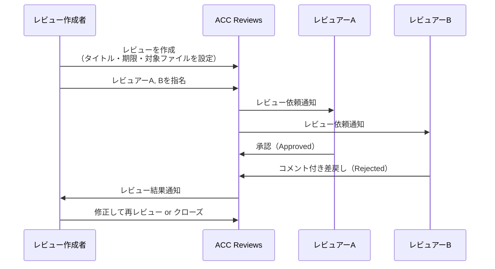

### レビュー機能の構成要素

レビュー機能は、3つの要素で構成されています。

| 要素 | 説明 | 例 |
|------|------|-----|
| **Review（レビュー）** | 承認ワークフロー全体の入れ物 | 「S棟構造図面レビュー第1回」 |
| **Review Item（レビューアイテム）** | レビュー対象のファイル | 構造図A-101.pdf、モデルv3.rvt |
| **Reviewer（レビュアー）** | レビューを行う担当者 | 構造設計担当、品質管理担当 |

```
レビュー「S棟構造図面レビュー第1回」
├── 対象ファイル
│   ├── A-101_構造平面図.pdf
│   ├── A-102_構造断面図.pdf
│   └── S棟_構造モデル_v3.rvt
│
└── レビュアー
    ├── 田中（構造設計） → 承認済み
    ├── 佐藤（品質管理） → 未回答
    └── 鈴木（現場監督） → コメント付き差戻し
```

---

## Reviews APIの全体像

### エンドポイント一覧

Reviews APIは、ACC Construction APIの一部として提供されています。ベースURLは以下の通りです。

```
https://developer.api.autodesk.com/construction/reviews/v1/projects/{projectId}
```

主要なエンドポイントを一覧にまとめます。

| 操作 | メソッド | パス | 用途 |
|------|---------|------|------|
| レビュー一覧取得 | GET | `/reviews` | 全レビューの一覧を取得 |
| レビュー詳細取得 | GET | `/reviews/{reviewId}` | 特定レビューの詳細情報 |
| レビュー作成 | POST | `/reviews` | 新規レビューの作成 |
| レビュー更新 | PATCH | `/reviews/{reviewId}` | タイトル・期限などの変更 |
| レビュアー一覧取得 | GET | `/reviews/{reviewId}/reviewers` | レビュアーと回答状況 |
| レビュアー追加 | POST | `/reviews/{reviewId}/reviewers` | 新しいレビュアーを追加 |
| レビューアイテム一覧 | GET | `/reviews/{reviewId}/review-items` | レビュー対象ファイル一覧 |

### エンドポイントの関係性

これらのエンドポイントがどう関係しているかを図にすると、こうなります。

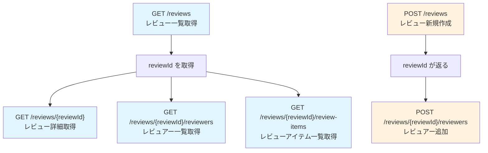

**読み取り系**（青）と**書き込み系**（オレンジ）に分けて考えると整理しやすいです。まずGETでレビュー一覧を取得し、そこから得た `reviewId` を使って詳細・レビュアー・アイテムの情報を掘り下げていくイメージです。

### 認証とスコープ

Reviews APIを利用するには、APSの認証トークンが必要です。

| 項目 | 内容 |
|------|------|
| 認証方式 | 2-legged OAuth2 または 3-legged OAuth2 |
| 読み取りに必要なスコープ | `data:read` |
| 書き込みに必要なスコープ | `data:read data:write` |
| カスタムインテグレーション登録 | 必須（登録しないと403エラー） |

:::message
**2-legged認証と3-legged認証の違い**
- **2-legged**: サーバー間通信用。ユーザーのログイン操作が不要。自動化スクリプトに最適
- **3-legged**: ユーザーがブラウザでログインして承認する方式。Webアプリ向き

自動化には2-legged認証が便利ですが、`x-user-id` ヘッダーの指定が必要になります。
:::

---

## レビューのライフサイクル

### レビュー全体のステータス遷移

レビューには3つの状態があり、以下のように遷移します。

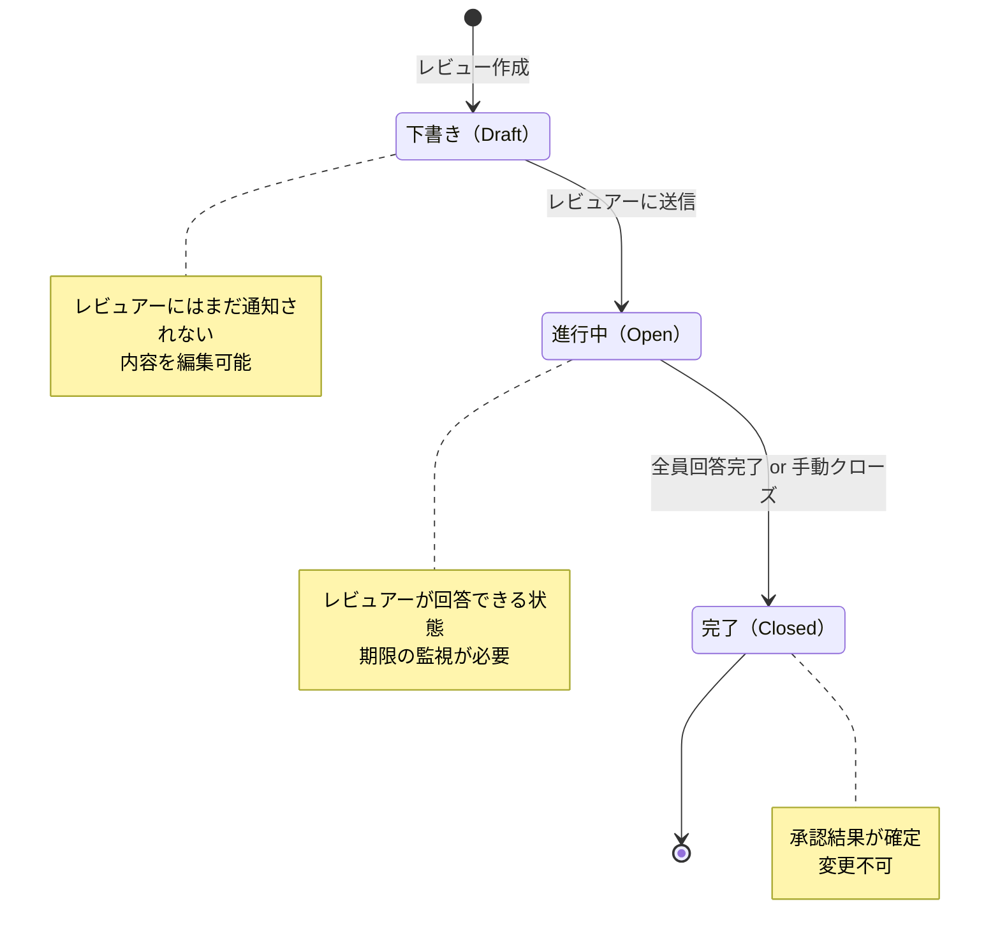

| ステータス | 意味 | APIでの値 | 備考 |
|-----------|------|-----------|------|
| 下書き | 作成中。レビュアーに通知されない | `draft` | 内容の編集が可能 |
| 進行中 | レビュアーが回答できる状態 | `open` | 期限の監視が重要 |
| 完了 | レビューが終了した状態 | `closed` | 結果が確定。変更不可 |

### レビュアーの回答ステータス

各レビュアーには個別のステータスがあります。

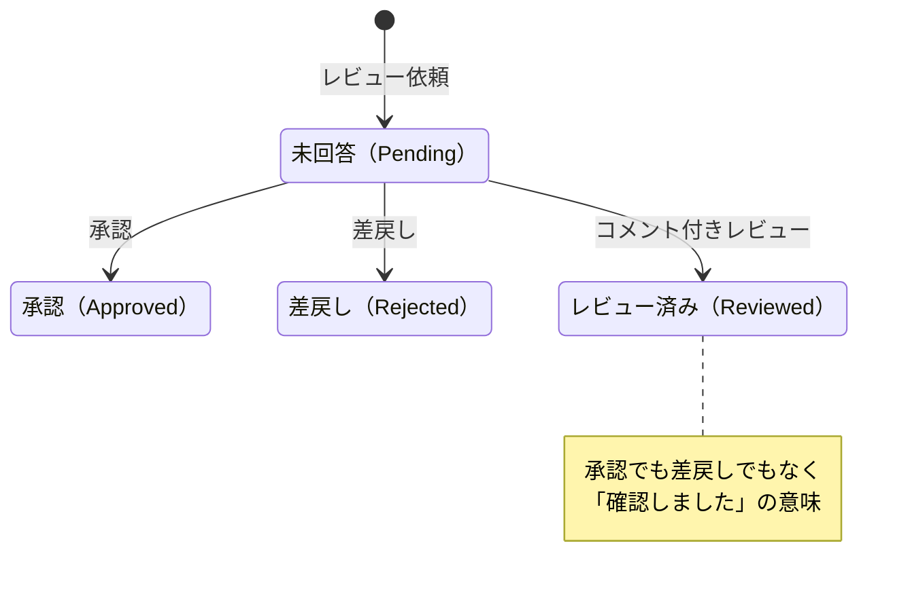

| レビュアーステータス | APIでの値 | 意味 |
|-------------------|-----------|------|
| 未回答 | `pending` | まだ回答していない |
| 承認 | `approved` | 問題なしと判断 |
| 差戻し | `rejected` | 修正が必要と判断 |
| レビュー済み | `reviewed` | 確認済み（承認でも差戻しでもない中間的な回答） |

### ワークフロータイプ

レビューには2つのワークフロータイプがあります。

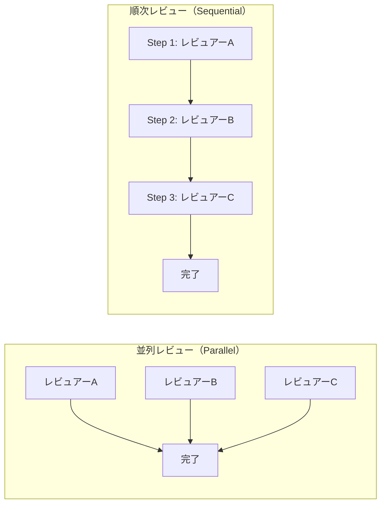

| タイプ | APIでの値 | 動作 | 適した場面 |
|-------|-----------|------|-----------|
| 並列 | `parallel` | 全員が同時にレビュー可能 | 複数分野の同時チェック |
| 順次 | `sequential` | ステップ順にレビュー | 階層的な承認フロー |

順次レビューでは、Step 1のレビュアーが回答するまでStep 2のレビュアーは回答できません。設計 → 品質管理 → 現場監督のように、段階的な承認が必要な場合に使います。

---

## 主要なデータ構造

### Review, Reviewer, Review Itemの関係

APIで取得できるデータの構造を図にまとめます。

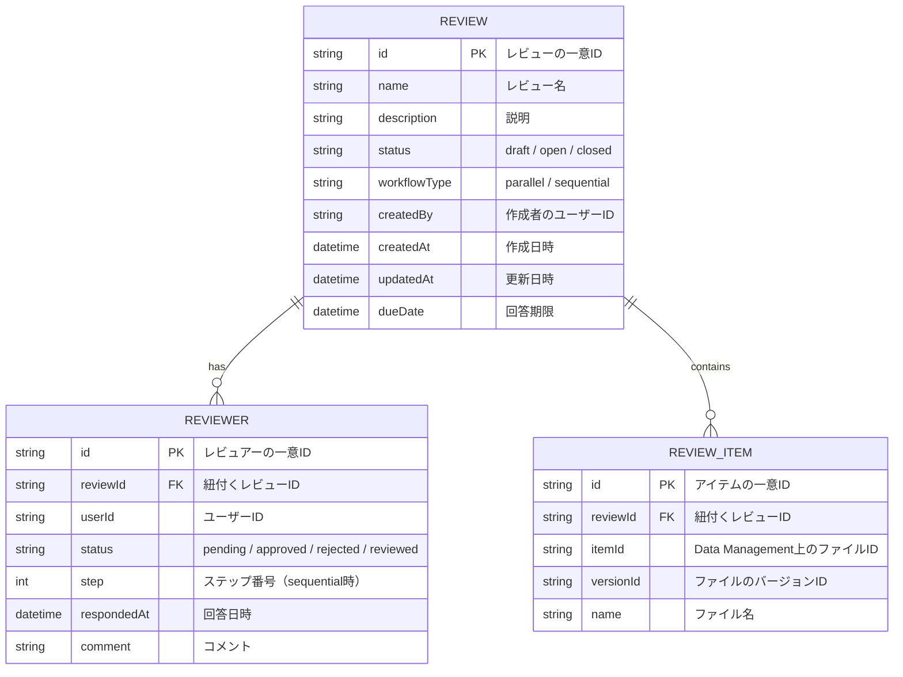

### 各データのJSON構造

実際にAPIから返ってくるJSONの構造を確認しておきましょう。

**Review（レビュー）のレスポンス例**:

```json
{
  "id": "a1b2c3d4-e5f6-7890-abcd-ef1234567890",
  "name": "S棟構造図面レビュー第1回",
  "description": "S棟構造図面の中間レビュー。構造計算書との整合性を確認",
  "status": "open",
  "workflowType": "parallel",
  "createdBy": "ABCDEF123456",
  "createdAt": "2025-03-01T09:00:00.000Z",
  "updatedAt": "2025-03-10T14:30:00.000Z",
  "dueDate": "2025-03-15T23:59:59.000Z"
}
```

**Reviewer（レビュアー）のレスポンス例**:

```json
{
  "id": "r1a2b3c4-d5e6-7890-abcd-ef1234567890",
  "reviewId": "a1b2c3d4-e5f6-7890-abcd-ef1234567890",
  "userId": "USER001",
  "status": "approved",
  "step": 1,
  "respondedAt": "2025-03-05T10:00:00.000Z",
  "comment": "構造計算書と整合しています。承認します。"
}
```

**Review Item（レビューアイテム）のレスポンス例**:

```json
{
  "id": "i1a2b3c4-d5e6-7890-abcd-ef1234567890",
  "reviewId": "a1b2c3d4-e5f6-7890-abcd-ef1234567890",
  "itemId": "urn:adsk.wipprod:dm.lineage:xxxxx",
  "versionId": "urn:adsk.wipprod:fs.file:versionId",
  "name": "A-101_構造平面図.pdf"
}
```

### データ取得の流れ

実際にAPIを使ってデータを取得する場合の流れです。

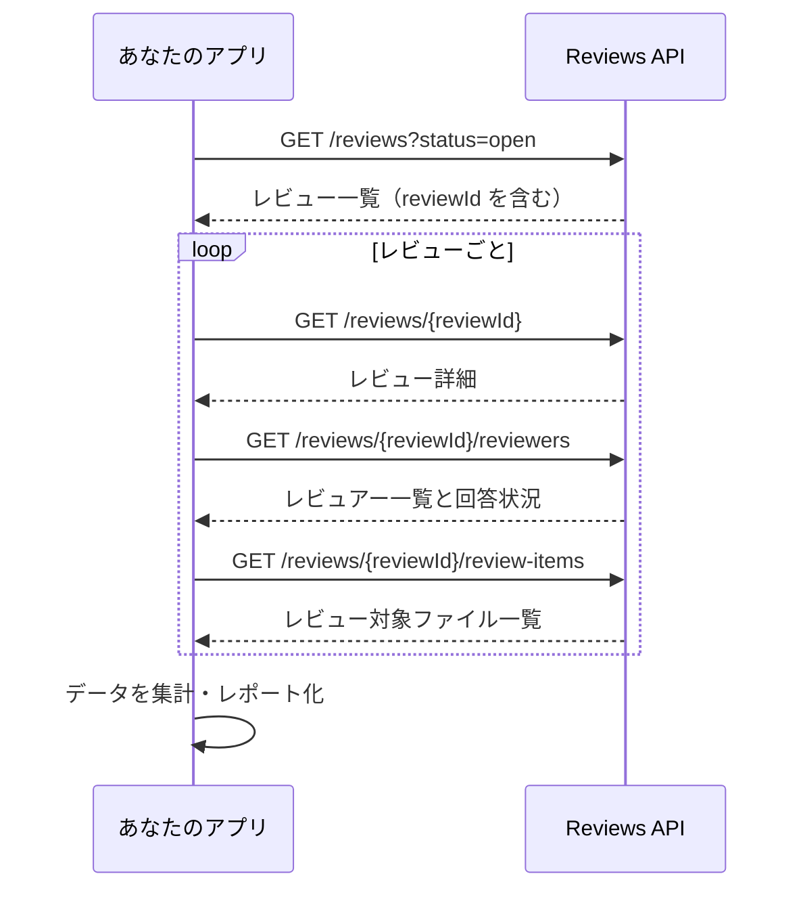

---

## APIで何ができて何ができないか

### できること

Reviews APIを使ってプログラムからできる操作を整理します。

| カテゴリ | できること | エンドポイント |
|---------|-----------|--------------|
| 読み取り | レビュー一覧の取得（フィルタ付き） | GET `/reviews` |
| 読み取り | レビュー詳細の取得 | GET `/reviews/{reviewId}` |
| 読み取り | レビュアーの一覧と回答状況の取得 | GET `/reviews/{reviewId}/reviewers` |
| 読み取り | レビュー対象ファイルの一覧取得 | GET `/reviews/{reviewId}/review-items` |
| 書き込み | 新規レビューの作成 | POST `/reviews` |
| 書き込み | レビュー情報の更新（タイトル・期限など） | PATCH `/reviews/{reviewId}` |
| 書き込み | レビュアーの追加 | POST `/reviews/{reviewId}/reviewers` |
| フィルタ | ステータスでの絞り込み | クエリパラメータ `?status=open` |
| ページネーション | 大量データの分割取得 | `?limit=20&offset=0` |

### できないこと・制約

APIには重要な制約があります。自動化を検討する前に必ず確認してください。

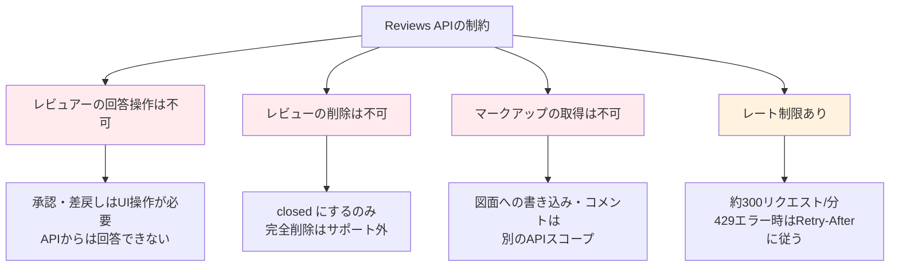

| 制約 | 詳細 | 代替手段 |
|------|------|---------|
| レビュアーの回答操作 | APIからApproved/Rejectedを設定できない | UI上で操作する必要がある |
| レビューの削除 | DELETEエンドポイントなし | ステータスを `closed` に変更するのみ |
| マークアップの取得 | 図面への赤入れ内容はReviews APIのスコープ外 | Issues APIなど別のAPIを検討 |
| レート制限 | APS共通で約300リクエスト/分 | リクエスト間に待機時間を入れる |
| ページネーション上限 | 1回のリクエストで取得できる件数に制限あり | `offset` を使って分割取得 |

:::message alert
**最も重要な制約**: レビュアーの承認・差戻しの操作はAPIからはできません。つまり「APIで自動的に全部承認する」といった操作は不可能です。承認行為は必ずUI上で人間が行う設計になっています。
:::

---

## 自動化のユースケース3選

APIの制約を踏まえた上で、実用的な自動化のユースケースを3つ紹介します。

### ユースケース1: 進捗ダッシュボード

全プロジェクトのレビュー状況をスプレッドシートに自動集計し、一覧で把握できるようにします。

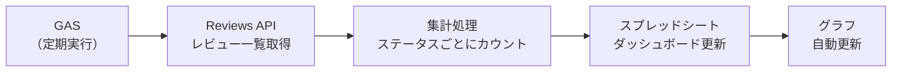

**ダッシュボードに表示する情報の例**:

| 指標 | 取得方法 | 活用場面 |
|------|---------|---------|
| オープン中のレビュー数 | `GET /reviews?status=open` の件数 | 未処理の把握 |
| 期限切れレビュー数 | `dueDate` が現在日時より前のもの | 遅延の早期発見 |
| レビュアー別の未回答数 | レビュアーの `status=pending` をカウント | ボトルネック特定 |
| 平均回答日数 | `respondedAt - createdAt` の平均 | プロセス改善 |
| 承認率 | `approved / (approved + rejected)` | 品質の傾向把握 |

### ユースケース2: リマインダー通知

未回答のレビュアーに自動でリマインダーを送る仕組みです。

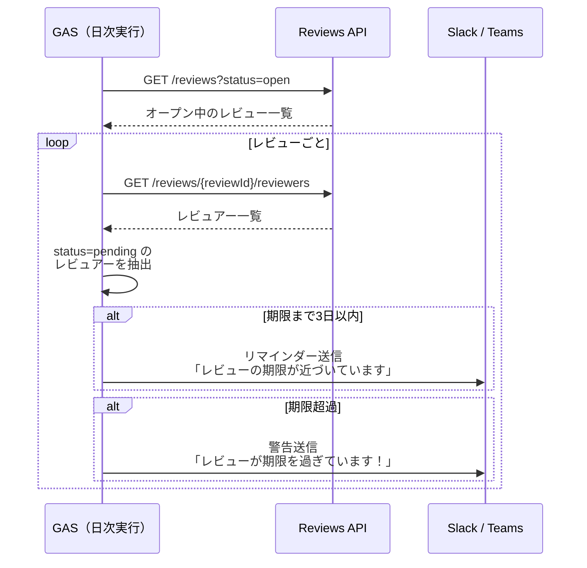

**通知の条件例**:

| 条件 | トリガー | メッセージ例 |
|------|---------|-------------|
| 期限3日前 | `dueDate - 3日` | 「レビュー『XX』の期限が3日後です。未回答です。」 |
| 期限当日 | `dueDate` 当日 | 「本日が期限です。至急ご対応ください。」 |
| 期限超過 | `dueDate` を過ぎた | 「期限を過ぎています。レビュー作成者にも通知済み。」 |
| 長期未回答 | 7日以上 `pending` | 「1週間以上未回答のレビューがあります。」 |

### ユースケース3: 承認レポートの自動生成

完了したレビューの結果をまとめたレポートを自動生成します。監査対応や品質記録として活用できます。

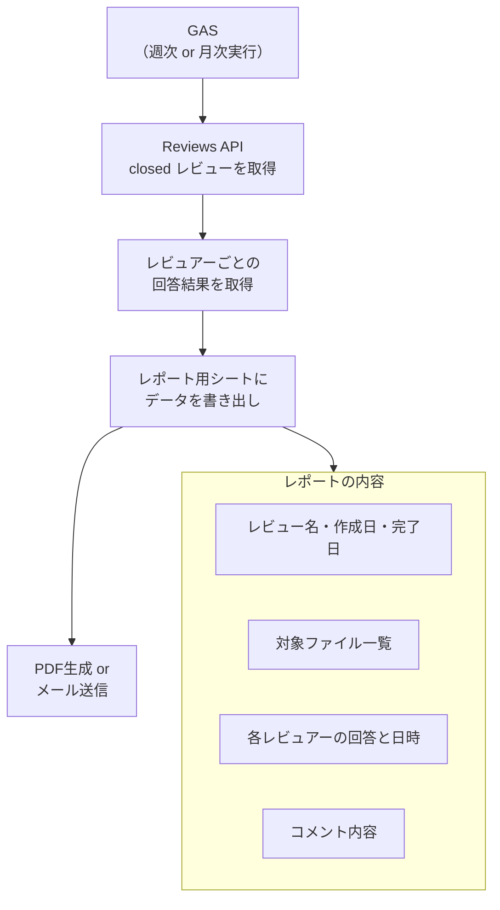

**レポートに含める項目の例**:

```
承認レポート: S棟構造図面レビュー第1回
───────────────────────────────────
作成日    : 2025-03-01
完了日    : 2025-03-12
期限      : 2025-03-15（期限内に完了）
ワークフロー: 並列レビュー

■ 対象ファイル
  1. A-101_構造平面図.pdf
  2. A-102_構造断面図.pdf
  3. S棟_構造モデル_v3.rvt

■ レビュー結果
  ┌──────────┬──────────┬────────────┬─────────────┐
  │ レビュアー │ ステータス │  回答日     │ コメント      │
  ├──────────┼──────────┼────────────┼─────────────┤
  │ 田中     │ 承認     │ 2025-03-05 │ 問題なし      │
  │ 佐藤     │ 承認     │ 2025-03-10 │ 軽微な指摘あり  │
  │ 鈴木     │ 承認     │ 2025-03-12 │ 修正確認済み   │
  └──────────┴──────────┴────────────┴─────────────┘

■ 総合結果: 全員承認 → 次フェーズへ進行可
```

---

## GASでレビュー一覧を取得するサンプルコード

ここでは、GAS（Google Apps Script）を使ってACCのレビュー一覧を取得し、スプレッドシートに書き出す簡易版のコードを紹介します。

:::message
この記事は解説記事のため、最小限のコードに留めています。本格的な実装（エラーハンドリング・ページネーション対応・リマインダー機能など）は、別の記事で詳しく扱う予定です。
:::

### ステップ1: 設定（config.gs）

```javascript
// config.gs
// スクリプトプロパティから設定を読み込む

const CONFIG = {
  get CLIENT_ID()     { return PropertiesService.getScriptProperties().getProperty('CLIENT_ID'); },
  get CLIENT_SECRET() { return PropertiesService.getScriptProperties().getProperty('CLIENT_SECRET'); },
  get PROJECT_ID()    { return PropertiesService.getScriptProperties().getProperty('PROJECT_ID'); },
  APS_BASE_URL: 'https://developer.api.autodesk.com',
  REVIEWS_BASE: 'https://developer.api.autodesk.com/construction/reviews/v1',
  SHEET_NAME: 'レビュー一覧',
};
```

スクリプトプロパティには以下を設定しておきます。

```
Apps Script エディタ
└── プロジェクトの設定
    └── スクリプト プロパティ
        ├── CLIENT_ID    = （APSアプリのClient ID）
        ├── CLIENT_SECRET = （APSアプリのClient Secret）
        └── PROJECT_ID   = b.xxxxxxxx-xxxx-xxxx-xxxx-xxxxxxxxxxxx
```

### ステップ2: 認証（auth.gs）

```javascript
// auth.gs
// 2-legged OAuth2 でアクセストークンを取得する

function getAccessToken() {
  const credentials = Utilities.base64Encode(
    CONFIG.CLIENT_ID + ':' + CONFIG.CLIENT_SECRET
  );

  const response = UrlFetchApp.fetch(
    CONFIG.APS_BASE_URL + '/authentication/v2/token',
    {
      method: 'post',
      headers: {
        'Authorization': 'Basic ' + credentials,
        'Content-Type': 'application/x-www-form-urlencoded'
      },
      payload: 'grant_type=client_credentials&scope=data%3Aread',
      muteHttpExceptions: true
    }
  );

  if (response.getResponseCode() !== 200) {
    throw new Error('トークン取得失敗: ' + response.getContentText());
  }

  return JSON.parse(response.getContentText()).access_token;
}
```

### ステップ3: レビュー一覧の取得（reviews.gs）

```javascript
// reviews.gs
// Reviews API からレビュー一覧を取得する

/**
 * 指定プロジェクトのレビュー一覧を取得する
 * @param {string} token - アクセストークン
 * @param {string} projectId - ACCプロジェクトID（b. プレフィックス不要）
 * @param {string} [status] - フィルタするステータス（open / closed / draft）
 * @returns {Array} レビューの配列
 */
function getReviews(token, projectId, status) {
  // プロジェクトIDから "b." プレフィックスを除去
  // Reviews APIでは "b." なしのIDを使う
  const cleanProjectId = projectId.replace(/^b\./, '');

  let url = `${CONFIG.REVIEWS_BASE}/projects/${cleanProjectId}/reviews`;

  // ステータスでフィルタする場合はクエリパラメータを追加
  if (status) {
    url += `?filter[status]=${status}`;
  }

  const response = UrlFetchApp.fetch(url, {
    headers: {
      'Authorization': 'Bearer ' + token
    },
    muteHttpExceptions: true
  });

  if (response.getResponseCode() !== 200) {
    Logger.log('レビュー取得エラー [' + response.getResponseCode() + ']: '
      + response.getContentText());
    return [];
  }

  const data = JSON.parse(response.getContentText());
  return data.results || [];
}

/**
 * 指定レビューのレビュアー一覧を取得する
 * @param {string} token - アクセストークン
 * @param {string} projectId - ACCプロジェクトID
 * @param {string} reviewId - レビューID
 * @returns {Array} レビュアーの配列
 */
function getReviewers(token, projectId, reviewId) {
  const cleanProjectId = projectId.replace(/^b\./, '');
  const url = `${CONFIG.REVIEWS_BASE}/projects/${cleanProjectId}/reviews/${reviewId}/reviewers`;

  const response = UrlFetchApp.fetch(url, {
    headers: {
      'Authorization': 'Bearer ' + token
    },
    muteHttpExceptions: true
  });

  if (response.getResponseCode() !== 200) {
    Logger.log('レビュアー取得エラー: ' + response.getContentText());
    return [];
  }

  const data = JSON.parse(response.getContentText());
  return data.results || [];
}
```

### ステップ4: スプレッドシートへの書き出し（main.gs）

```javascript
// main.gs
// メイン処理: レビュー一覧をスプレッドシートに書き出す

function fetchReviewsToSheet() {
  const ss = SpreadsheetApp.getActiveSpreadsheet();
  let sheet = ss.getSheetByName(CONFIG.SHEET_NAME);

  // シートがなければ新規作成
  if (!sheet) {
    sheet = ss.insertSheet(CONFIG.SHEET_NAME);
  }

  // ヘッダー行を設定
  const headers = [
    'レビューID', 'レビュー名', 'ステータス', 'ワークフロー',
    '作成日', '期限', 'レビュアー数', '未回答数', '承認数', '差戻し数'
  ];
  sheet.getRange(1, 1, 1, headers.length).setValues([headers]);
  sheet.getRange(1, 1, 1, headers.length).setFontWeight('bold');

  // トークン取得
  Logger.log('アクセストークンを取得中...');
  const token = getAccessToken();

  // レビュー一覧を取得（全ステータス）
  Logger.log('レビュー一覧を取得中...');
  const reviews = getReviews(token, CONFIG.PROJECT_ID);

  if (reviews.length === 0) {
    Logger.log('レビューが見つかりませんでした');
    SpreadsheetApp.getUi().alert('レビューが見つかりませんでした');
    return;
  }

  Logger.log(reviews.length + '件のレビューを取得しました');

  // 既存データをクリア（ヘッダー行を除く）
  if (sheet.getLastRow() > 1) {
    sheet.getRange(2, 1, sheet.getLastRow() - 1, headers.length).clear();
  }

  const rows = [];

  for (let i = 0; i < reviews.length; i++) {
    const review = reviews[i];

    // 各レビューのレビュアー情報を取得
    const reviewers = getReviewers(token, CONFIG.PROJECT_ID, review.id);

    // レビュアーのステータスを集計
    const pending  = reviewers.filter(r => r.status === 'pending').length;
    const approved = reviewers.filter(r => r.status === 'approved').length;
    const rejected = reviewers.filter(r => r.status === 'rejected').length;

    rows.push([
      review.id,
      review.name,
      review.status,
      review.workflowType || '-',
      review.createdAt ? new Date(review.createdAt).toLocaleDateString('ja-JP') : '-',
      review.dueDate ? new Date(review.dueDate).toLocaleDateString('ja-JP') : '-',
      reviewers.length,
      pending,
      approved,
      rejected
    ]);

    // レート制限対策: 200msの間隔を空ける
    Utilities.sleep(200);
  }

  // スプレッドシートに一括書き込み
  if (rows.length > 0) {
    sheet.getRange(2, 1, rows.length, headers.length).setValues(rows);
  }

  const message = `完了！ ${rows.length}件のレビューを取得しました`;
  Logger.log(message);
  SpreadsheetApp.getUi().alert(message);
}
```

### 実行結果のイメージ

コードを実行すると、スプレッドシートにこのような一覧が出力されます。

| レビューID | レビュー名 | ステータス | ワークフロー | 作成日 | 期限 | レビュアー数 | 未回答数 | 承認数 | 差戻し数 |
|-----------|-----------|-----------|------------|--------|------|------------|---------|-------|---------|
| a1b2... | S棟構造図面レビュー第1回 | closed | parallel | 2025/3/1 | 2025/3/15 | 3 | 0 | 3 | 0 |
| c3d4... | 設備図面チェック | open | sequential | 2025/3/5 | 2025/3/20 | 4 | 2 | 1 | 1 |
| e5f6... | 外構計画レビュー | open | parallel | 2025/3/10 | 2025/3/25 | 2 | 2 | 0 | 0 |

---

## よくある質問とトラブルシューティング

### Q&A

| 質問 | 回答 |
|------|------|
| プロジェクトIDの `b.` は必要？ | Reviews APIでは `b.` プレフィックスを除去して使います。コード例では `replace(/^b\./, '')` で自動除去しています |
| 3-legged認証でも使える？ | はい。ユーザーに代わってレビュー情報を取得する場合は3-legged認証が適しています |
| レビューは何件まで取得できる？ | 1回のリクエストで取得できる件数には上限があります。`limit` と `offset` パラメータでページネーションしてください |
| APIでレビューを承認できる？ | いいえ。レビュアーの回答（承認・差戻し）はUI操作が必要です。これはAPIの仕様上の制約です |

### エラー対応表

| エラーコード | 原因 | 対処法 |
|------------|------|-------|
| `401 Unauthorized` | トークンが無効または期限切れ | トークンを再取得する |
| `403 Forbidden` | カスタムインテグレーション未登録 or スコープ不足 | ACC管理画面でClient IDを登録、スコープに `data:read` を追加 |
| `404 Not Found` | プロジェクトIDが間違っている | `b.` プレフィックスの有無を確認 |
| `429 Too Many Requests` | レート制限超過 | `Retry-After` ヘッダーの秒数だけ待ってリトライ |

### 403エラーの確認フロー

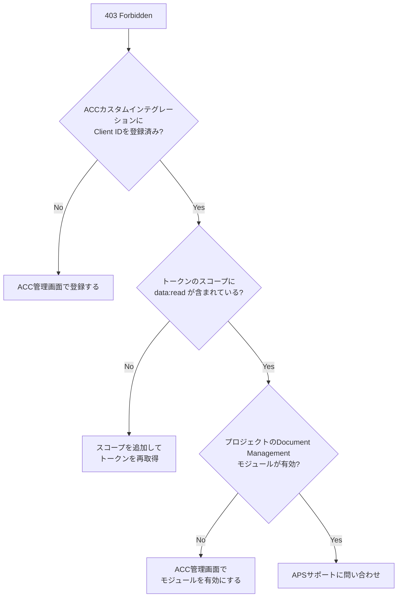

---

## まとめ ― 実装に進むための次のステップ

この記事で解説した内容を振り返ります。

```
■ Reviews APIの全体像
  ├── 読み取り系: レビュー一覧・詳細・レビュアー・アイテムの取得
  ├── 書き込み系: レビュー作成・更新・レビュアー追加
  └── 制約: レビュアーの回答操作・削除はAPI不可

■ ステータス遷移
  ├── レビュー全体: draft → open → closed
  └── レビュアー: pending → approved / rejected / reviewed

■ 自動化ユースケース
  ├── 進捗ダッシュボード（レビュー状況の可視化）
  ├── リマインダー通知（未回答者への催促）
  └── 承認レポート（監査・品質記録用）
```

### 次のステップ

Reviews APIを使った自動化に進むために、以下の順番で取り組むのがおすすめです。

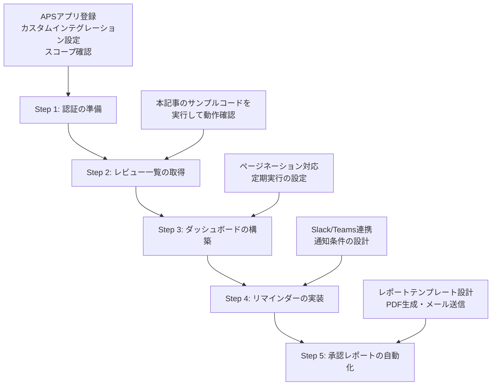

| ステップ | 内容 | 難易度 |
|---------|------|--------|
| Step 1 | APSアプリ登録・認証トークン取得 | 低（ACC-002の記事を参照） |
| Step 2 | レビュー一覧をスプレッドシートに出力 | 低（本記事のコードで対応可） |
| Step 3 | 進捗ダッシュボードの構築 | 中 |
| Step 4 | リマインダー通知の実装 | 中 |
| Step 5 | 承認レポートの自動生成 | 高 |

まずは本記事のサンプルコードでレビュー一覧を取得するところから始めてみてください。「APIで情報を取れる」と実感できれば、ダッシュボードやリマインダーへの応用は自然と見えてきます。

---

## 参考リンク

- [ACC Reviews API リファレンス](https://aps.autodesk.com/en/docs/acc/v1/reference/http/reviews-GET/)
- [ACC Reviews API フィールドガイド](https://aps.autodesk.com/en/docs/acc/v1/overview/field-guide/reviews/)
- [ACC API 全体概要](https://aps.autodesk.com/en/docs/acc/v1/overview/)
- [APS 認証 v2 リファレンス](https://aps.autodesk.com/en/docs/oauth/v2/reference/http/gettoken-POST)
- [Google Apps Script UrlFetchApp リファレンス](https://developers.google.com/apps-script/reference/url-fetch/url-fetch-app)
- [ACC-002: GASでACCのフォルダ構成を一括作成する（シリーズ関連記事）](./acc-002-gas-acc-folder-creation.md)
