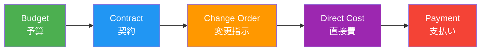
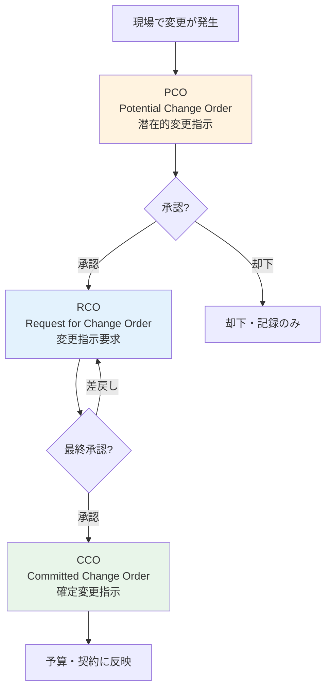
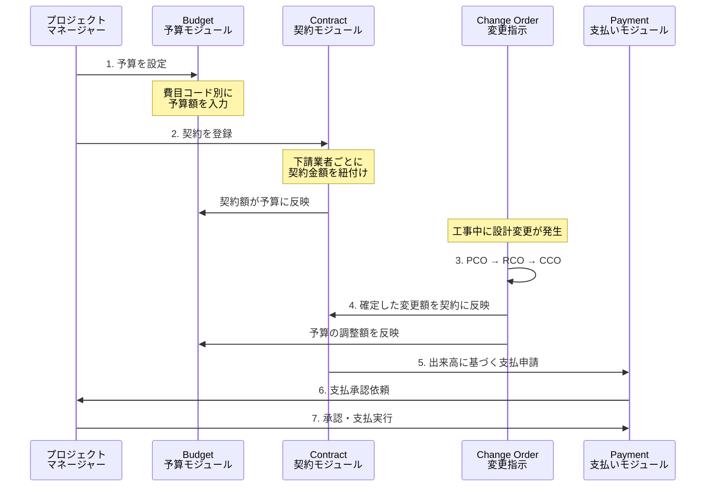
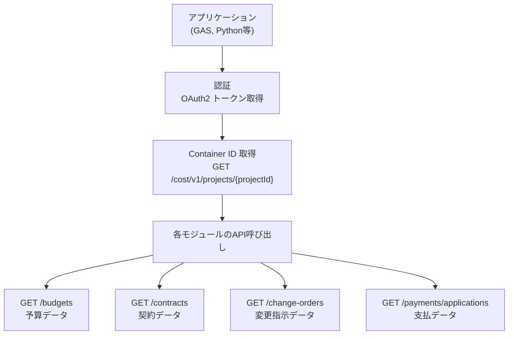
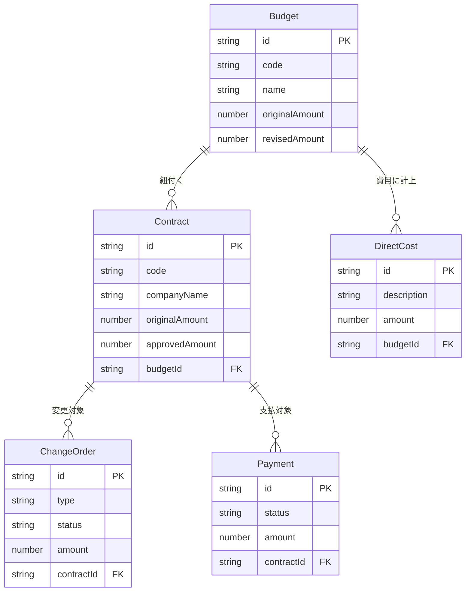
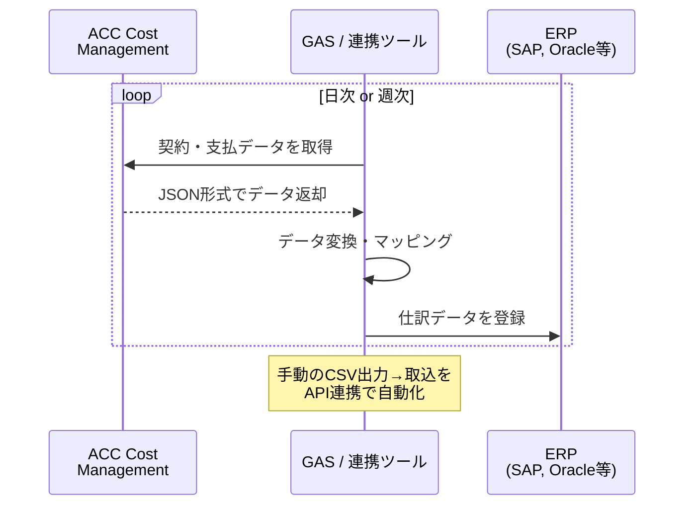
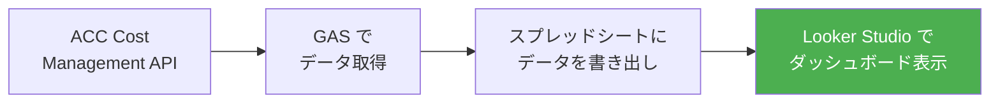
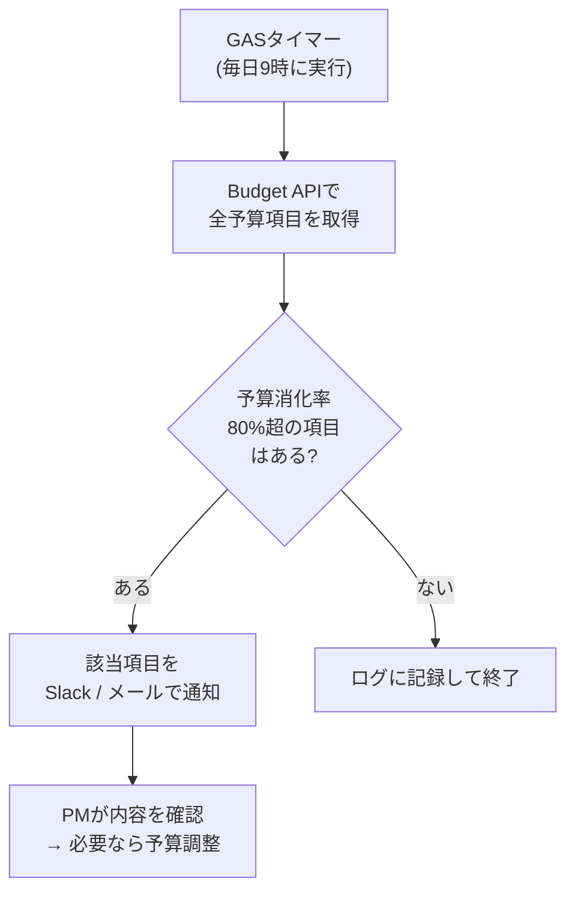
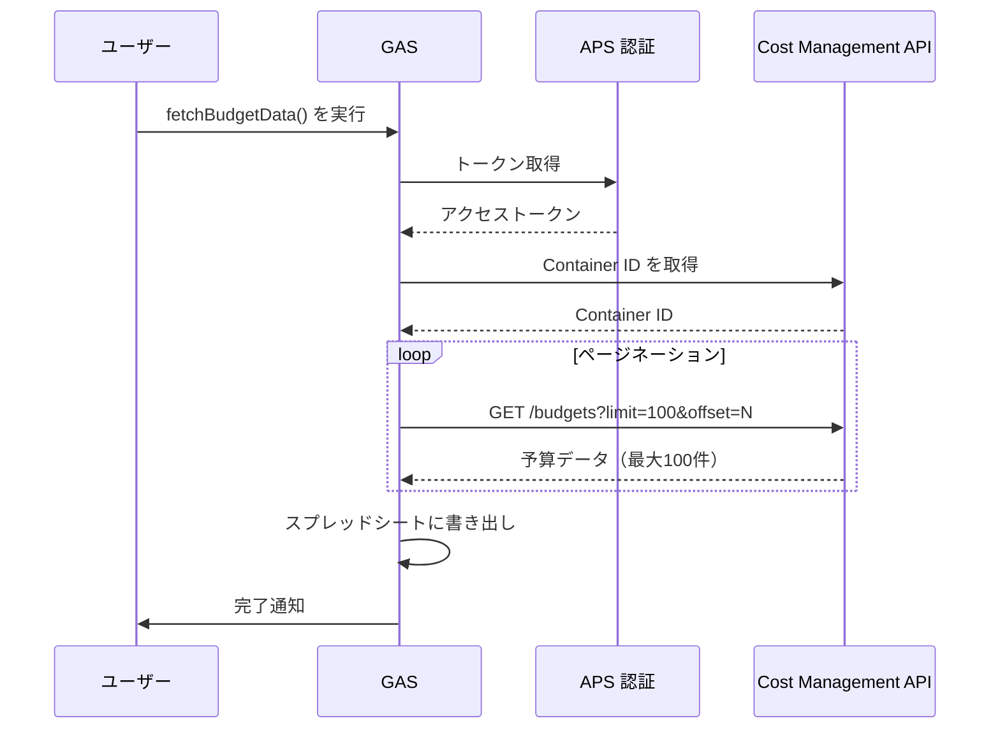
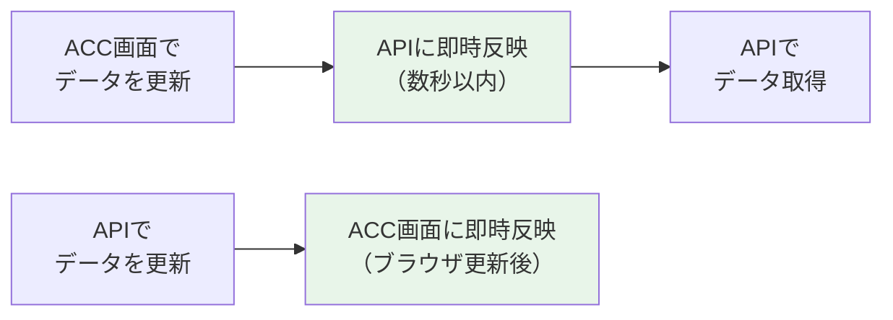

## はじめに

建設プロジェクトのコスト管理、まだExcelの台帳で回していませんか？

予算の策定、契約金額の管理、設計変更に伴うコスト変更の追跡、出来高に基づく支払い...これらを個別のファイルで管理していると、「最新版はどれ？」「予算残はいくら？」という問いに即答できなくなります。

**ACC（Autodesk Construction Cloud）の Cost Management** は、こうしたプロジェクトのコスト管理をクラウド上で一元化する機能です。さらに **Cost Management API** を使えば、蓄積されたデータをプログラムで取得し、ERPとの連携やレポート自動化も実現できます。

この記事では、Cost Managementの全体像を整理し、APIの概要と簡単なコード例までを一気に解説します。

**この記事でわかること**:
- Cost Managementの5つの主要モジュールとその役割
- 予算設定から支払いまでのワークフロー
- Cost Management APIで取得できるデータの構造
- GASで予算データを取得するサンプルコード

**対象読者**: ACCを業務で使っているBIM担当者・建設プロジェクトマネージャー
**前提知識**: ACCの基本操作ができること。APIの経験は不要です（コードは読み流してOK）

---

## Cost Managementとは

ACC Cost Managementは、建設プロジェクトの**予算策定から支払い完了まで**を一つのプラットフォームで管理する機能です。

```
┌─────────────────────────────────────────────────────┐
│  ACC（Autodesk Construction Cloud）                   │
│                                                       │
│  ┌──────────┐  ┌──────────┐  ┌──────────────────┐    │
│  │ Document │  │ Design   │  │ Cost             │    │
│  │Management│  │Collabora │  │ Management       │    │
│  │          │  │  tion    │  │ ← 本記事の対象     │    │
│  └──────────┘  └──────────┘  └──────────────────┘    │
│  ┌──────────┐  ┌──────────┐  ┌──────────────────┐    │
│  │ Model    │  │ Build    │  │ Insight          │    │
│  │Coordinat │  │          │  │                  │    │
│  │  ion     │  │          │  │                  │    │
│  └──────────┘  └──────────┘  └──────────────────┘    │
└─────────────────────────────────────────────────────┘
```

### 従来の管理方法との違い

| 項目 | Excel台帳での管理 | ACC Cost Management |
|------|------------------|---------------------|
| データの所在 | 各担当者のPC・共有フォルダ | クラウド上に一元管理 |
| 最新版の把握 | ファイル名に日付を付けて管理 | 常に最新データにアクセス |
| 予算残の確認 | 手動で集計が必要 | リアルタイムで自動集計 |
| 変更履歴 | 変更履歴シートに手入力 | 自動で変更履歴を記録 |
| 承認フロー | メールや紙の回覧 | システム上でワークフロー管理 |
| 他システム連携 | CSV出力→手動取り込み | APIで自動連携が可能 |

---

## 5つの主要モジュール

Cost Managementは5つのモジュールで構成されています。それぞれが建設プロジェクトのコスト管理における重要な役割を担っています。



### 各モジュールの概要

| モジュール | 役割 | 管理する内容 | 主な利用者 |
|-----------|------|------------|-----------|
| **Budget（予算）** | プロジェクトの総予算を費目別に設定 | 費目コード、予算額、配分 | プロジェクトマネージャー |
| **Contract（契約）** | 元請・下請間の契約を管理 | 契約金額、契約先、契約書 | 契約管理担当 |
| **Change Order（変更指示）** | 設計変更・追加工事のコスト変更を追跡 | PCO（潜在的変更）、RCO（要求変更）、CCO（確定変更） | 設計変更管理担当 |
| **Direct Cost（直接費）** | 契約外の直接経費を記録 | 資材費、仮設費、諸経費 | 現場管理者 |
| **Payment（支払い）** | 出来高に基づく支払申請・承認 | 支払申請書、出来高率、保留金 | 経理・支払管理担当 |

### Budget（予算）モジュールの詳細

予算モジュールは、プロジェクトのコスト管理の出発点です。費目コード（Cost Code）を使って予算を体系的に管理します。

```
予算の構造（Budget Structure）
├── 01 - 総合仮設
│   ├── 01-100 仮囲い・仮設事務所     ¥12,000,000
│   ├── 01-200 足場・養生             ¥8,500,000
│   └── 01-300 安全対策               ¥3,000,000
├── 02 - 躯体工事
│   ├── 02-100 鉄筋工事               ¥45,000,000
│   ├── 02-200 型枠工事               ¥32,000,000
│   └── 02-300 コンクリート工事        ¥28,000,000
├── 03 - 仕上工事
│   ├── 03-100 外装工事               ¥25,000,000
│   └── 03-200 内装工事               ¥18,000,000
└── 04 - 設備工事
    ├── 04-100 電気設備               ¥22,000,000
    └── 04-200 機械設備               ¥15,000,000
──────────────────────────────────────
合計                                  ¥208,500,000
```

### Change Order（変更指示）の3段階フロー

変更指示は、建設プロジェクトで最もコスト超過のリスクがあるプロセスです。Cost Managementでは3段階で管理します。



| 段階 | 略称 | 状態 | 予算への影響 |
|------|------|------|------------|
| 潜在的変更指示 | PCO | まだ確定していない変更候補 | 反映されない |
| 変更指示要求 | RCO | 正式に変更を要求した状態 | 「保留中」として表示 |
| 確定変更指示 | CCO | 承認され確定した変更 | 予算・契約に反映される |

---

## コスト管理のワークフロー

プロジェクト全体を通したコスト管理の流れを見てみましょう。



### 各フェーズでの主要アクション

| フェーズ | 作業内容 | モジュール | 誰が行うか |
|---------|---------|-----------|-----------|
| 計画段階 | 費目コード体系の設定 | Budget | PM |
| 計画段階 | 予算額の入力・配分 | Budget | PM・積算担当 |
| 契約段階 | 下請契約の登録 | Contract | 契約管理担当 |
| 契約段階 | 契約書類の添付 | Contract | 契約管理担当 |
| 施工段階 | 設計変更の記録（PCO作成） | Change Order | 現場担当 |
| 施工段階 | 変更指示の承認（RCO→CCO） | Change Order | PM |
| 施工段階 | 直接費の記録 | Direct Cost | 現場管理者 |
| 支払段階 | 出来高報告・支払申請 | Payment | 下請業者・経理 |
| 支払段階 | 支払承認・実行 | Payment | PM・経理 |

---

## 画面構成と操作の概要

ACC Cost Managementの画面は、各モジュールがタブで切り替えられる構成になっています。

```
┌──────────────────────────────────────────────────────┐
│  ACC > プロジェクト名 > Cost Management               │
├──────────────────────────────────────────────────────┤
│  [Budget] [Contract] [Change Order] [Direct Cost]    │
│  [Payment] [Settings]                                │
├──────────────────────────────────────────────────────┤
│                                                      │
│  ┌──────────────────────────────────────────────┐    │
│  │  サマリーカード                                │    │
│  │  ┌──────┐ ┌──────┐ ┌──────┐ ┌──────┐        │    │
│  │  │ 予算  │ │ 契約  │ │ 変更  │ │ 残額  │        │    │
│  │  │¥208M │ │¥185M │ │¥12M  │ │¥11M  │        │    │
│  │  └──────┘ └──────┘ └──────┘ └──────┘        │    │
│  └──────────────────────────────────────────────┘    │
│                                                      │
│  ┌──────────────────────────────────────────────┐    │
│  │  一覧テーブル（フィルタ・ソート・CSV出力可能）    │    │
│  │  ┌──────┬──────┬──────┬──────┬──────┐        │    │
│  │  │Code  │項目名 │予算額 │契約額 │残額   │        │    │
│  │  ├──────┼──────┼──────┼──────┼──────┤        │    │
│  │  │01-100│仮設  │¥12M  │¥11M  │¥1M   │        │    │
│  │  │02-100│鉄筋  │¥45M  │¥43M  │¥2M   │        │    │
│  │  └──────┴──────┴──────┴──────┴──────┘        │    │
│  └──────────────────────────────────────────────┘    │
└──────────────────────────────────────────────────────┘
```

### Budget画面の主要カラム

| カラム名 | 説明 | 計算方法 |
|---------|------|---------|
| Original Budget | 当初予算 | 手動入力 |
| Budget Adjustments | 予算調整額 | CCOから自動反映 |
| Revised Budget | 改訂予算 | Original + Adjustments |
| Committed Cost | 確定原価（契約額） | Contractから自動集計 |
| Committed Changes | 確定変更額 | CCOから自動集計 |
| Revised Committed | 改訂確定原価 | Committed + Changes |
| Variance | 差異 | Revised Budget - Revised Committed |

---

## Cost Management APIの概要

Cost Management APIを使うと、画面で見ているデータをプログラムで取得・操作できます。

### APIの基本構造



### 重要: Container IDについて

Cost Management APIでは、通常のプロジェクトID（`b.xxx`形式）ではなく、**Container ID** という別のIDを使います。これはCost Managementモジュール専用の識別子です。

```
プロジェクトID（b.xxx）
  └── Container ID（cost:xxx）← Cost Management API で使う
```

Container IDはプロジェクト情報から取得できます。

### エンドポイント一覧

| メソッド | エンドポイント | 説明 | 用途 |
|---------|-------------|------|------|
| GET | `/cost/v1/containers/{id}/budgets` | 予算一覧を取得 | 予算データの取得・レポート |
| GET | `/cost/v1/containers/{id}/contracts` | 契約一覧を取得 | 契約情報の取得・ERP連携 |
| GET | `/cost/v1/containers/{id}/change-orders` | 変更指示一覧を取得 | CO状況の追跡 |
| GET | `/cost/v1/containers/{id}/payments/applications` | 支払申請一覧を取得 | 支払状況の確認 |
| GET | `/cost/v1/containers/{id}/expense-items` | 直接費一覧を取得 | 経費データの取得 |
| GET | `/cost/v1/containers/{id}/budget-codes` | 費目コード一覧を取得 | コード体系の確認 |

### 共通クエリパラメータ

| パラメータ | 型 | 説明 | 例 |
|-----------|-----|------|-----|
| `limit` | integer | 取得件数の上限（デフォルト: 20, 最大: 100） | `?limit=100` |
| `offset` | integer | 取得開始位置 | `?offset=100` |
| `sort` | string | ソート条件 | `?sort=name asc` |
| `filter` | string | フィルタ条件 | `?filter[status]=active` |

---

## APIで取得できるデータの構造

各エンドポイントが返すデータの主要フィールドを見てみましょう。

### Budget（予算）のレスポンス構造

```json
{
  "pagination": {
    "limit": 20,
    "offset": 0,
    "totalResults": 45
  },
  "results": [
    {
      "id": "xxxxxxxx-xxxx-xxxx-xxxx-xxxxxxxxxxxx",
      "code": "02-100",
      "name": "鉄筋工事",
      "originalAmount": 45000000,
      "adjustedAmount": 2000000,
      "revisedAmount": 47000000,
      "committedAmount": 43000000,
      "committedChanges": 1500000,
      "revisedCommitted": 44500000,
      "variance": 2500000,
      "status": "active",
      "createdAt": "2025-04-01T00:00:00.000Z",
      "updatedAt": "2025-06-15T10:30:00.000Z"
    }
  ]
}
```

### Contract（契約）のレスポンス構造

```json
{
  "pagination": {
    "limit": 20,
    "offset": 0,
    "totalResults": 12
  },
  "results": [
    {
      "id": "yyyyyyyy-yyyy-yyyy-yyyy-yyyyyyyyyyyy",
      "code": "C-001",
      "name": "鉄筋工事一式",
      "type": "purchase_order",
      "status": "approved",
      "companyName": "山田建設株式会社",
      "originalAmount": 43000000,
      "approvedAmount": 44500000,
      "paidAmount": 22000000,
      "retentionAmount": 2200000,
      "budgetId": "xxxxxxxx-xxxx-xxxx-xxxx-xxxxxxxxxxxx",
      "startDate": "2025-05-01",
      "endDate": "2025-12-31"
    }
  ]
}
```

### データの関連図



---

## 活用ユースケース

Cost Management APIを活用する代表的なシナリオを3つ紹介します。

### ユースケース1: ERPとの連携



**メリット**:
- 経理担当が手作業でデータを転記する手間が不要になる
- 転記ミスがなくなる
- リアルタイムに近い形で財務データを更新できる

### ユースケース2: レポート自動化



自動化できるレポートの例:

| レポート名 | 取得データ | 更新頻度 |
|-----------|----------|---------|
| 予算消化率レポート | Budget（予算 vs 確定原価） | 週次 |
| 変更指示サマリー | Change Order（PCO/RCO/CCO件数・金額） | 日次 |
| 支払状況一覧 | Payment（申請・承認・支払済み） | 月次 |
| 下請業者別契約一覧 | Contract（業者名・契約額・支払額） | 随時 |

### ユースケース3: 予算超過アラート



**通知メッセージの例**:
```
[予算アラート] プロジェクト: 新宿オフィスビル新築工事

以下の費目で予算消化率が80%を超えています:

| 費目コード | 項目名     | 予算額      | 確定原価    | 消化率 |
|-----------|-----------|------------|------------|-------|
| 02-200    | 型枠工事   | ¥32,000,000 | ¥28,800,000 | 90.0% |
| 03-100    | 外装工事   | ¥25,000,000 | ¥21,250,000 | 85.0% |

確認をお願いします。
```

---

## GASで予算データを取得するサンプルコード

ここからは実際にGASでCost Management APIを呼び出すコード例を示します。ACC-002で解説した認証の仕組みをベースにしています。

### ステップ1: 設定と認証（config.gs / auth.gs）

認証部分はACC-002と同じ仕組みです。スクリプトプロパティに以下を設定してください。

```
Apps Script エディタ
└── プロジェクトの設定
    └── スクリプト プロパティ
        ├── CLIENT_ID       = （APSのClient ID）
        ├── CLIENT_SECRET   = （APSのClient Secret）
        └── ACC_PROJECT_ID  = （ACCプロジェクトのID）
```

```javascript
// config.gs
const CONFIG = {
  get CLIENT_ID()     { return PropertiesService.getScriptProperties().getProperty('CLIENT_ID'); },
  get CLIENT_SECRET() { return PropertiesService.getScriptProperties().getProperty('CLIENT_SECRET'); },
  get PROJECT_ID()    { return PropertiesService.getScriptProperties().getProperty('ACC_PROJECT_ID'); },
  APS_BASE_URL: 'https://developer.api.autodesk.com',
};
```

```javascript
// auth.gs
function getAccessToken() {
  const credentials = Utilities.base64Encode(
    CONFIG.CLIENT_ID + ':' + CONFIG.CLIENT_SECRET
  );

  const response = UrlFetchApp.fetch(
    CONFIG.APS_BASE_URL + '/authentication/v2/token',
    {
      method: 'post',
      headers: {
        'Authorization': 'Basic ' + credentials,
        'Content-Type': 'application/x-www-form-urlencoded'
      },
      payload: 'grant_type=client_credentials&scope=data%3Aread%20account%3Aread',
      muteHttpExceptions: true
    }
  );

  if (response.getResponseCode() !== 200) {
    throw new Error('トークン取得失敗: ' + response.getContentText());
  }
  return JSON.parse(response.getContentText()).access_token;
}
```

### ステップ2: Container IDの取得（cost.gs）

Cost Management APIを呼ぶにはContainer IDが必要です。プロジェクトIDからContainer IDを取得する関数を用意します。

```javascript
// cost.gs

/**
 * プロジェクトIDからCost ManagementのContainer IDを取得する
 * ※ Container IDはCost Managementモジュール専用のIDで、
 *    プロジェクトIDとは異なります
 */
function getContainerId(token, projectId) {
  // プロジェクトIDから "b." プレフィックスを除去
  const cleanId = projectId.replace(/^b\./, '');

  const url = `${CONFIG.APS_BASE_URL}/project/v1/hubs/b.${getAccountId(token)}/projects/${projectId}`;
  const response = UrlFetchApp.fetch(url, {
    headers: { 'Authorization': 'Bearer ' + token },
    muteHttpExceptions: true
  });

  if (response.getResponseCode() !== 200) {
    throw new Error('プロジェクト情報の取得失敗: ' + response.getContentText());
  }

  const data = JSON.parse(response.getContentText());
  // Cost Management の Container ID を取得
  const costContainer = data.data.relationships.cost.data;
  return costContainer.id;
}

/**
 * アカウントIDを取得する
 */
function getAccountId(token) {
  const response = UrlFetchApp.fetch(
    CONFIG.APS_BASE_URL + '/project/v1/hubs',
    {
      headers: { 'Authorization': 'Bearer ' + token },
      muteHttpExceptions: true
    }
  );
  const data = JSON.parse(response.getContentText());
  // ハブIDから "b." を除去してアカウントIDとして返す
  return data.data[0].id.replace(/^b\./, '');
}
```

### ステップ3: 予算データの取得とシート出力（main.gs）

```javascript
// main.gs

/**
 * 予算データをACCから取得してスプレッドシートに出力する
 */
function fetchBudgetData() {
  const token = getAccessToken();
  Logger.log('トークン取得完了');

  const containerId = getContainerId(token, CONFIG.PROJECT_ID);
  Logger.log('Container ID: ' + containerId);

  // 予算データを全件取得（ページネーション対応）
  const budgets = fetchAllBudgets(token, containerId);
  Logger.log(`予算データ ${budgets.length} 件を取得`);

  // スプレッドシートに出力
  writeBudgetsToSheet(budgets);

  SpreadsheetApp.getUi().alert(`完了: ${budgets.length}件の予算データを取得しました`);
}

/**
 * ページネーションに対応して全予算データを取得する
 * APIは1回のリクエストで最大100件しか返さないため、
 * offsetを使って繰り返し取得する必要がある
 */
function fetchAllBudgets(token, containerId) {
  const allBudgets = [];
  let offset = 0;
  const limit = 100; // 1回の取得上限

  while (true) {
    const url = `${CONFIG.APS_BASE_URL}/cost/v1/containers/${containerId}/budgets`
              + `?limit=${limit}&offset=${offset}`;

    const response = UrlFetchApp.fetch(url, {
      headers: { 'Authorization': 'Bearer ' + token },
      muteHttpExceptions: true
    });

    if (response.getResponseCode() !== 200) {
      throw new Error(`予算データ取得失敗 [${response.getResponseCode()}]: ${response.getContentText()}`);
    }

    const data = JSON.parse(response.getContentText());
    allBudgets.push(...data.results);

    // 全件取得済みか確認
    if (allBudgets.length >= data.pagination.totalResults) {
      break;
    }

    offset += limit;
    Utilities.sleep(200); // レート制限対策
  }

  return allBudgets;
}

/**
 * 予算データをスプレッドシートに書き出す
 */
function writeBudgetsToSheet(budgets) {
  const ss = SpreadsheetApp.getActiveSpreadsheet();
  let sheet = ss.getSheetByName('予算データ');

  // シートがなければ新規作成
  if (!sheet) {
    sheet = ss.insertSheet('予算データ');
  } else {
    sheet.clear(); // 既存データをクリア
  }

  // ヘッダー行
  const headers = [
    '費目コード', '項目名', '当初予算', '予算調整額',
    '改訂予算', '確定原価', '変更額', '改訂確定原価',
    '差異', 'ステータス', '最終更新日'
  ];
  sheet.getRange(1, 1, 1, headers.length).setValues([headers]);

  // データ行
  if (budgets.length === 0) {
    Logger.log('予算データがありません');
    return;
  }

  const rows = budgets.map(b => [
    b.code || '',
    b.name || '',
    b.originalAmount || 0,
    b.adjustedAmount || 0,
    b.revisedAmount || 0,
    b.committedAmount || 0,
    b.committedChanges || 0,
    b.revisedCommitted || 0,
    b.variance || 0,
    b.status || '',
    b.updatedAt || ''
  ]);

  sheet.getRange(2, 1, rows.length, headers.length).setValues(rows);

  // ヘッダー行を太字にする
  sheet.getRange(1, 1, 1, headers.length).setFontWeight('bold');

  // 金額列に通貨書式を設定（C列〜I列）
  if (rows.length > 0) {
    sheet.getRange(2, 3, rows.length, 7).setNumberFormat('#,##0');
  }

  Logger.log('スプレッドシートへの書き出し完了');
}
```

### 処理の流れ



---

## 制約・注意点

Cost Management APIを利用する際に知っておくべき制約事項をまとめます。

### モジュールの有効化が必要

Cost Managementは、ACCのプロジェクト設定で**明示的に有効化**する必要があります。有効化されていないプロジェクトではAPIがエラーを返します。

```
ACC管理画面
└── プロジェクト設定
    └── モジュール
        └── Cost Management → 「有効」にする
```

### APIの制約一覧

| 制約 | 内容 | 対処法 |
|------|------|-------|
| レート制限 | 短時間に大量のリクエストを送ると429エラー | `Utilities.sleep()` で間隔を空ける |
| ページネーション | 1回のリクエストで最大100件 | offset/limitで繰り返し取得 |
| 読み取り中心 | 一部エンドポイントは読み取り専用 | 書き込みが必要な場合はUI操作を併用 |
| Container IDの必要性 | プロジェクトIDとは別のIDが必要 | 初回にプロジェクト情報APIで取得 |
| 認証スコープ | `data:read`, `account:read` が最低限必要 | APSポータルでスコープを設定 |
| カスタムインテグレーション | ACC管理画面での登録が必要 | アカウント管理者に依頼 |

### よくあるエラーと対処法

| エラーコード | 原因 | 対処法 |
|------------|------|-------|
| `401 Unauthorized` | トークンの期限切れ or スコープ不足 | トークンを再取得、スコープを確認 |
| `403 Forbidden` | カスタムインテグレーション未登録 | ACC管理画面でClient IDを登録 |
| `404 Not Found` | Container IDが不正 or モジュール未有効化 | プロジェクト設定でCost Managementを有効化 |
| `429 Too Many Requests` | レート制限超過 | リクエスト間隔を空けてリトライ |

### データ更新のタイミング



ACC画面での操作とAPIは**リアルタイムに同期**されます。ただし、Change Orderの承認ワークフローなど、ステータス遷移にはビジネスルールが適用されるため、APIからの直接的なステータス変更には制限がある場合があります。

---

## まとめ

この記事では、ACC Cost Managementの全体像を解説しました。

```
この記事で学んだこと
├── Cost Managementの5つのモジュール
│   ├── Budget     ― 予算を費目コード別に管理
│   ├── Contract   ― 下請契約を管理
│   ├── Change Order ― 設計変更のコスト影響を3段階で追跡
│   ├── Direct Cost  ― 契約外の直接経費を記録
│   └── Payment      ― 出来高ベースの支払いを管理
│
├── コスト管理のワークフロー
│   └── 予算設定 → 契約 → 変更管理 → 支払い
│
├── Cost Management APIの基本
│   ├── Container IDの概念
│   ├── 主要エンドポイント（budgets, contracts, change-orders等）
│   └── ページネーション対応
│
└── GASでのデータ取得サンプル
    └── 予算データを取得してスプレッドシートに出力
```

**重要ポイントの振り返り**:

1. **Container IDが必要** — プロジェクトIDとは別のIDを使う点がつまずきポイント
2. **ページネーション対応は必須** — 予算項目が多いプロジェクトでは全件取得にループが必要
3. **Change Orderは3段階（PCO→RCO→CCO）** — 確定前の変更を「潜在的変更」として管理できるのがExcelにない強み
4. **APIは読み取り中心** — まずはデータ取得・レポート自動化から始めるのが現実的

### 次のステップ

この記事ではCost Managementの概要を学びました。次の記事 **ACC-013「Cost Management API連携の詳細」** では、以下の内容を詳しく解説する予定です。

- 契約データの取得と加工
- Change Orderの状況をリアルタイムに追跡するダッシュボード構築
- ERPへのデータ連携の実装パターン
- 予算超過アラートの実装

---

## 参考リンク

- [ACC Cost Management フィールドガイド](https://aps.autodesk.com/en/docs/acc/v1/overview/field-guide/cost-management/)
- [Cost Management API - Budgets](https://aps.autodesk.com/en/docs/acc/v1/reference/http/cost-budgets-GET/)
- [Cost Management API - Contracts](https://aps.autodesk.com/en/docs/acc/v1/reference/http/cost-contracts-GET/)
- [Cost Management チュートリアル](https://aps.autodesk.com/en/docs/acc/v1/tutorials/cost-management/)
- [APS 認証 v2 リファレンス](https://aps.autodesk.com/en/docs/oauth/v2/reference/http/gettoken-POST)
- [Google Apps Script UrlFetchApp](https://developers.google.com/apps-script/reference/url-fetch/url-fetch-app)
- [ACC-002: GASでACCのフォルダ構成を一括作成する（シリーズ関連記事）](./acc-002-gas-acc-folder-creation.md)
